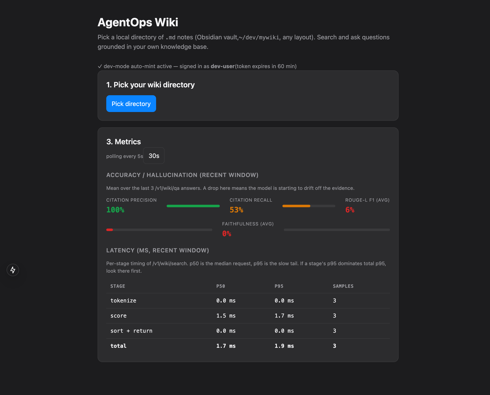

# AgentOps Workbench

> **Pivot (2026-09-13).** The description below is the historical scope —
> left as written, not deleted. The portfolio narrative has moved to
> open-source-maintainer / developer-tooling automation (the domain the
> author can judge and defend; generic customer support is retired from
> the narrative permanently), built on a general `EvidenceSourceAdapter`
> pattern with five real, tested implementations
> ([PR #34](https://github.com/sh-ai-x/AgentOpsPipeline/pull/34)), scoped
> to one flagship flow — `agentops-oss-helper <github-repo-url>` — plus a
> real deployment target (Fly.io). Full design:
> [`docs/proposals/agentops-workbench-proposal.md`](docs/proposals/agentops-workbench-proposal.md)
> §"Pivot (2026-09-13)" and §"Update 2 (2026-09-13)"; the decisions
> themselves are recorded in
> [ADR-0007](apps/agentops-workbench/docs/adr/0007-evidence-source-adapter-pattern.md)
> and
> [ADR-0008](apps/agentops-workbench/docs/adr/0008-github-url-cli-and-deployment-target.md).
> Nothing below this note is deployed yet — see
> [`phases/08-deployable-mvp/index.md`](phases/08-deployable-mvp/index.md)
> for exit criteria.

A **Next.js 15 web chat over a local LLM Wiki directory** (Obsidian vault) —
multi-turn retrieval-augmented conversation with per-turn groundedness metrics
(Faithfulness, Citation Precision/Recall, ROUGE-L F1), Obsidian deep-links back
to source notes, and a live per-stage latency dashboard. Built on LangGraph
with a Wiki-only [EvidenceSourceAdapter](apps/agentops-workbench/docs/adr/0007-evidence-source-adapter-pattern.md);
the flagship flow is `agentops-oss-helper <github-repo-url>`,
[Wiki-only per ADR-0009](apps/agentops-workbench/docs/adr/0009-oss-helper-docs-only-scope.md).

The contribution is one complete application — not a general-purpose agent
framework. LangGraph from the first release, an MCP document server and a
pinned filesystem server, plus the Wiki Adapter abstraction that lets the same
retrieval / groundedness stack point at any markdown tree.

- **Scope of record:** [`docs/proposals/agentops-workbench-proposal.md`](docs/proposals/agentops-workbench-proposal.md)
- **Application:** [`apps/agentops-workbench/`](apps/agentops-workbench/) — `src/`, `fixtures/`, `experiments/`, `docker/`, test count tracked in [`apps/agentops-workbench/docs/EVIDENCE_CARD.md`](apps/agentops-workbench/docs/EVIDENCE_CARD.md)
- **Phase index + build audit:** [`phases/index.md`](phases/index.md), [`phases/build-report.md`](phases/build-report.md)
- **ADR catalogue:** [`docs/adr/README.md`](docs/adr/README.md)

---

## Screenshot

The operator UI is the **Next.js 15 web chat** at
`apps/agentops-workbench/web/`: pick a local wiki directory, then ask
questions in a multi-turn thread. Every turn reports groundedness
metrics (Faithfulness, Citation Recall, Citation Precision, ROUGE-L F1)
plus per-stage latency, with Obsidian deep-links back to the source
notes. Full detail in
[`apps/agentops-workbench/README.md#web-ui-wiki-chat`](apps/agentops-workbench/README.md#web-ui-wiki-chat).



---

## Usage

Two processes: the FastAPI backend that serves `/v1/wiki/*`, and the
Next.js dev server that serves the chat UI.

```bash
cd apps/agentops-workbench
uv sync --extra dev
cp .env.example .env   # AGENTOPS_MINIMAX_API_KEY for a live provider; local-fake needs none

# Terminal 1 — backend. AGENTOPS_ALLOW_DEV_TOKEN=1 lets the web UI
# auto-mint a dev JWT so there is no token to paste locally.
AGENTOPS_ALLOW_DEV_TOKEN=1 \
  uv run uvicorn agentops_workbench.api.server:app --port 8000

# Terminal 2 — frontend, then open http://localhost:3000/
cd apps/agentops-workbench/web && npm install && npx next dev --port 3000
```

Checks:

```bash
cd apps/agentops-workbench
uv run pytest -q
uv run ruff check .
```

Full detail — provider setup, the four groundedness metrics, Obsidian
deep-links, the latency dashboard — is in
[`apps/agentops-workbench/README.md`](apps/agentops-workbench/README.md).

---

## Reference docs

| Doc | Path |
|---|---|
| Design proposal (scope SSOT) | [`docs/proposals/agentops-workbench-proposal.md`](docs/proposals/agentops-workbench-proposal.md) |
| Phase index | [`phases/index.md`](phases/index.md) |
| Build audit (per-step verdicts) | [`phases/build-report.md`](phases/build-report.md) |
| ADR catalogue | [`docs/adr/README.md`](docs/adr/README.md) |
| App README (architecture + layout) | [`apps/agentops-workbench/README.md`](apps/agentops-workbench/README.md) |

## License

The `apps/agentops-workbench/` application is MIT
([`apps/agentops-workbench/LICENSE`](apps/agentops-workbench/LICENSE)).
