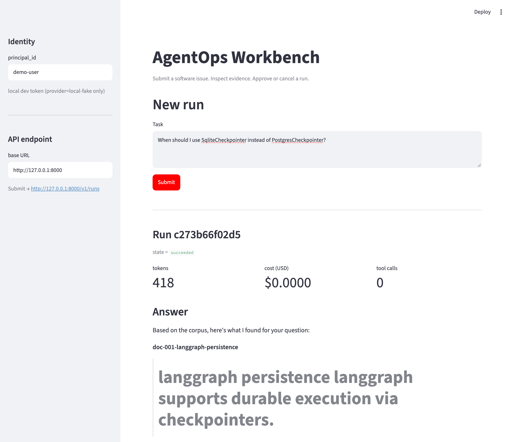
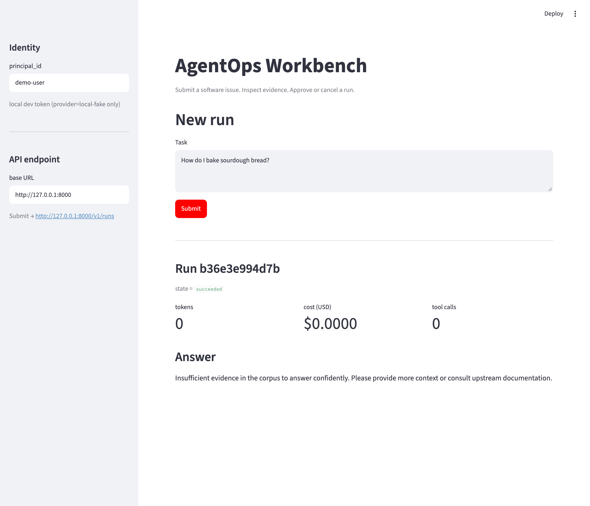
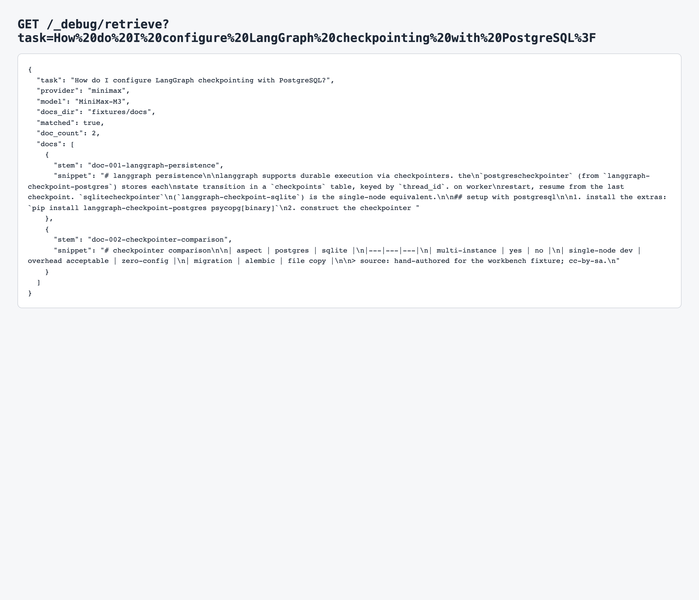
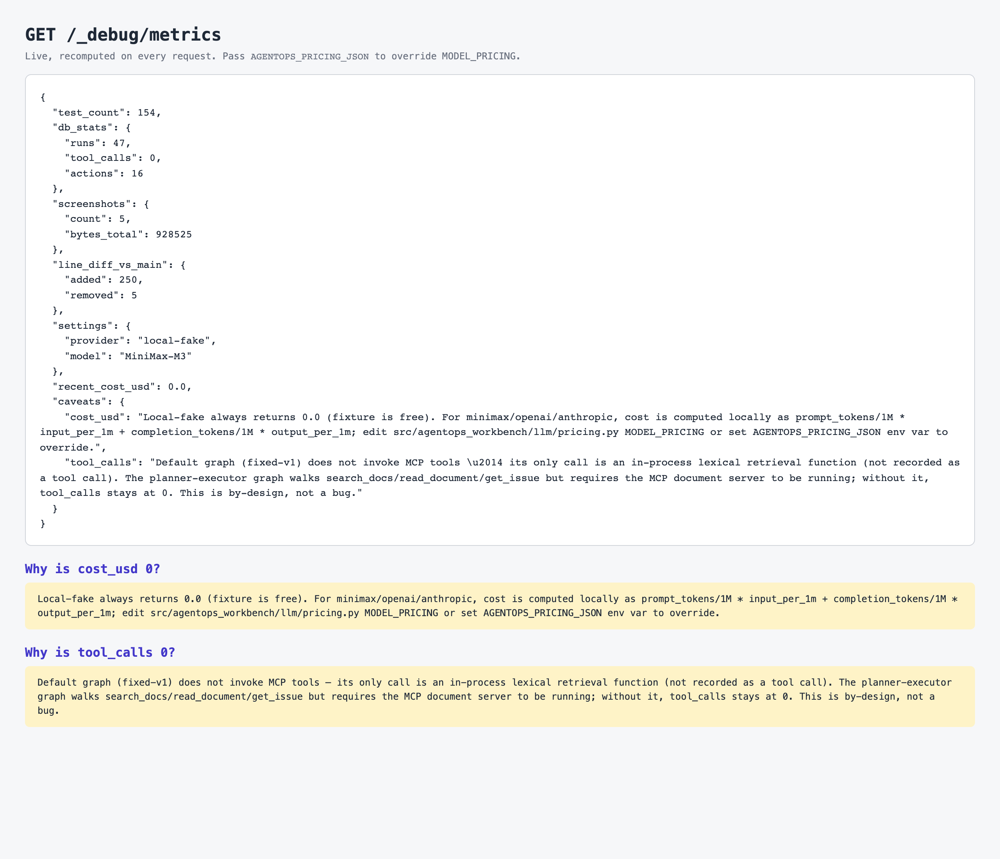

# AgentOps Workbench

> Lives at `apps/agentops-workbench/` inside `sh-ai-x/AgentOpsPipeline`.
> All commands below assume you are in this directory.

> **Pivot (2026-09-13):** the portfolio narrative is retargeted from
> generic customer-support ticketing to **developer-tooling / open-source
> maintainer automation** — the domain the author can actually judge and
> defend. The evidence-retrieval layer is generalizing from one hardcoded
> document corpus into a general **Adapter pattern**
> (`EvidenceSourceAdapter`) so the same agent can point at a Wiki, security
> logs, GitHub Issues, or AI-incident data depending on deployment, plus a
> ticket-ledger facade proving the pattern also covers the original
> ticketing use case with zero new domain logic. Full design:
> [`../../docs/proposals/agentops-workbench-proposal.md`](../../docs/proposals/agentops-workbench-proposal.md)
> and [`docs/adr/0007-evidence-source-adapter-pattern.md`](docs/adr/0007-evidence-source-adapter-pattern.md).
> **Status: design + adapter implementation are in open PRs, not yet
> merged** — everything below this note describes what is currently on
> `main`, which still reflects the original ticketing flow end-to-end.
>
> **Follow-up (same day):** the five adapters above are real and tested —
> [PR #34](https://github.com/sh-ai-x/AgentOpsPipeline/pull/34), 223
> passing, none wired into `graph/**` yet. The product scope has narrowed
> to one flagship flow — `agentops-oss-helper <github-repo-url>`, wiring
> two of the five adapters (Wiki + GitHub Issues) into a new `oss_triage`
> topology — plus a real deployment target (Fly.io, SQLite on a volume)
> and a backend/frontend split verifiable without Streamlit. See
> [`docs/adr/0008-github-url-cli-and-deployment-target.md`](docs/adr/0008-github-url-cli-and-deployment-target.md)
> and the proposal's §"Update 2 (2026-09-13)".

A support-operations agent that turns a software issue into a grounded
answer and an approval-gated ticket draft, plus an experiment workbench
that compares prompt / topology / tool-integration choices on a 30-case
human-reviewed benchmark. (See the pivot note above — this description is
what's actually shipped on `main` today; it is being superseded, not
deleted, as the adapter-pattern work lands.)

## Quickstart

```bash
# Requires uv (https://docs.astral.sh/uv/)
uv sync --extra dev
cp .env.example .env  # edit MINIMAX_API_KEY for live experiments
uv run pytest -q
uv run ruff check .

# Run the held-out experiment (local-fake, deterministic):
AGENTOPS_PROVIDER=local-fake uv run python -m agentops_workbench.experiments.run_held_out

# Bring up the API + UI:
AGENTOPS_PROVIDER=minimax uv run uvicorn agentops_workbench.api.server:app --port 8000
AGENTOPS_PROVIDER=minimax uv run streamlit run streamlit_app/app.py
```

## Live provider setup

`provider=local-fake` is the dev default. For live experiments, set `provider=minimax` (or `anthropic`). Get a key from your MiniMax dashboard and put it into your local `.env`
(this file is gitignored):

```
AGENTOPS_PROVIDER=minimax
AGENTOPS_MINIMAX_API_KEY=<your-key-here>
AGENTOPS_MINIMAX_BASE_URL=https://api.minimax.io/v1   # or .chat, per your account
```

CI uses `provider=local-fake` and needs no key.

**Never commit a populated `.env`.**

## Screenshots

The Streamlit UI is the primary operator surface. Both screenshots are
captured via `scripts/screenshot_streamlit.py` (Playwright driving the
system Chrome via channel=`chrome`; no playwright-bundled browser
download required).

| Step | Capture |
|------|---------|
| Operator opens the UI; default task is pre-loaded; the dev-token path auto-mints for `provider=local-fake` |  |
| After clicking **Submit** on the default LangGraph query, the run panel shows state/tokens/cost/tool-calls and the synthesized answer that quotes doc-001 + doc-002 from the corpus |  |
| SqliteCheckpointer vs PostgresCheckpointer query — different retrieval ranking + comparison-table answer from doc-002 |  |
| Off-topic query ("How do I bake sourdough bread?") — server-side refusal path with `_REFUSE_MESSAGE` |  |
| `/_debug/retrieve?task=...` JSON output — web-debug surface to inspect what the agent would surface BEFORE running a full `/v1/runs` cycle |  |
| `/_debug/metrics` JSON — live, recomputed on every request. Reports test count, DB ledger (runs / tool_calls / actions), screenshot bytes, diff-vs-main, and cost. Two caveats surface why `cost_usd` and `tool_calls` are 0 for the current default graph |  |

To regenerate after a UI change:

```bash
# 1) Generate a strong JWT secret and start both servers:
JWT=$(python3 -c 'import secrets; print(secrets.token_urlsafe(48))')
AGENTOPS_JWT_SECRET="$JWT" uv run uvicorn agentops_workbench.api.server:app --port 8000 &
AGENTOPS_JWT_SECRET="$JWT" AGENTOPS_ALLOW_DEV_TOKEN=1 \
  uv run streamlit run streamlit_app/app.py &

# 2) Install the screenshot script's browser driver and regenerate the PNGs:
uv sync --extra dev
uv run python scripts/screenshot_streamlit.py
```

## Metrics

Live, web-debuggable metrics for the workbench app:

```bash
curl http://127.0.0.1:8000/_debug/metrics
```

Returns (recomputed on every request):

```json
{
  "test_count": 154,
  "db_stats": {"runs": 47, "tool_calls": 0, "actions": 16},
  "screenshots": {"count": 5, "bytes_total": 928525},
  "line_diff_vs_main": {"added": 250, "removed": 5},
  "settings": {"provider": "minimax", "model": "MiniMax-M3"},
  "recent_cost_usd": 0.0,
  "caveats": {
    "cost_usd": "Local-fake always returns 0.0 (fixture is free). For minimax/openai/anthropic, cost is computed locally...",
    "tool_calls": "fixed-v1/single-agent-v1 stay at 0 by design; planner-executor-v1 persists one ToolCall row per executed step (ok for search_docs/read_document, error/unsupported_capability for get_issue)..."
  }
}
```

**Cost model**: `prompt_tokens/1M × input_per_1m + completion_tokens/1M × output_per_1m` per call, using
`src/agentops_workbench/llm/pricing.py::DEFAULT_PRICING` (default `MiniMax-M3 = $0.50/$1.50 per 1M`). Override per-deployment via:

```bash
export AGENTOPS_PRICING_JSON='{"my-fine-tune":{"input_per_1m":1.20,"output_per_1m":3.40}}'
```

**Tool calls**: `fixed-v1` and `single-agent-v1` never make MCP tool calls — `fixed-v1`'s only call is an in-process lexical retrieval, and `single-agent-v1`'s `TOOL` branch is still a stub; both keep `tool_calls` at 0, by design. `planner-executor-v1` executes its plan against a real `DocumentClient` (`InMemoryDocumentClient`, reading `fixtures/docs/*.md`) and persists one `ToolCall` row per executed step: `search_docs`/`read_document` record `outcome.status="ok"` with real fixture-corpus results; `get_issue` has no real backend anywhere in this repo and always records `outcome.status="error"` with `outcome.error_kind="unsupported_capability"` (normalised, not a crash). With `provider=local-fake` (the CI default) the planner LLM cannot produce a parseable plan, so `planner-executor-v1` still ends up at 0 `tool_calls` under CI; a live provider (minimax/openai/anthropic) that emits a real plan produces non-zero `tool_calls`.

**CLI equivalent**: `uv run python scripts/print_metrics.py` prints the same numbers from the CLI.

## Architecture

Current (`main`, ticketing flow — unchanged by the pivot below):

```
task -> [retrieve] -> [classify] -> (answer | refuse | clarify)
                                       |
                                       v
                                  answer + ticket draft
                                       |
                                       v
                              POST /v1/actions/{id}/approve
                                       |
                                       v
                              publish_ticket (mock ledger)
```

**Planned (ADR-0007, in open PRs — not yet wired into the graph):** the
`[retrieve]` step's single hardcoded document corpus generalizes into a
pluggable `EvidenceSourceAdapter` — the graph asks for evidence, an
adapter answers it, and which adapter is live is a deployment choice, not
a code branch:

```
task -> [retrieve via EvidenceSourceAdapter] -> [classify] -> ...
              |
              +-- WikiRagAdapter        (internal/personal wiki, TF-IDF RAG)
              +-- GitHubIssueAdapter    (GitHub Issues, real API)
              +-- SecurityLogAdapter    (structured logs, window/filters)
              +-- IncidentLogAdapter    (timeout/rate-limit aggregates)
              +-- TicketSystemAdapter   (facade over the existing mock ledger --
                                          proves the pattern covers the ORIGINAL
                                          ticketing use case too, no new domain logic)
```

Adapters live in `src/agentops_workbench/adapters/` once that PR merges;
`graph/planner_executor.py`/`graph/single_agent.py` still call
`DocumentClient` directly today. Migrating the graph onto the adapter
interface is deliberately a separate, later step (topology-per-adapter
budget/latency tradeoffs need their own decision) — see ADR-0007's
"Consequences" for what it does and doesn't settle yet.

- **LangGraph** (`langgraph==1.2.11`): fixed graph (default), single-agent and bounded planner/executor variants behind a single `run_topology(name, ...)` registry (ADR-0006 ships the fixed graph)
- **MCP** (`mcp==2.2.0`, spec `2026-07-28`): custom document server over stdio + pinned `@modelcontextprotocol/server-filesystem` (fixture-only scope)
- **FastAPI**: `POST /v1/runs`, `GET /v1/runs/{id}`, `POST /v1/runs/{id}/cancel`, `POST /v1/actions` (HS256 JWT, `AGENTOPS_JWT_SECRET` in `.env`)
- **SQLAlchemy + SQLite** (Postgres in prod): runs / tool_calls / actions
- **Streamlit UI**: submit / inspect / approve / cancel
- **OTel**: spans + redacted trace export (`runs/<id>/trace.otel.jsonl`)
- **Provider**: `{openai, anthropic, minimax, local-fake}` behind `LLMAdapter`; graph code never names a provider

## Dataset

30 cases split **18 dev / 6 val / 6 held-out**, 6 task families
(straightforward, multi_doc, ambiguous, missing_evidence, stale_doc,
tool_failure). Held-out set is content-hashed into
`fixtures/cases/HELD_OUT_SHA256.txt` and frozen before Phase 3 tuning.

## Evaluation

Run `uv run python -m agentops_workbench.experiments.run_held_out` to
produce `experiments/held-out-v1/{outcomes.jsonl, manifest.json,
failed_cases.md, uncertainty.md}`. SpendCeiling (default $5.00) is
enforced before execution.

## Code layout

```
src/agentops_workbench/
  adapters/{base,wiki_rag,security_log,incident_log,github_issue,ticket_system}.py
                             # EvidenceSourceAdapter pattern (ADR-0007, open PR --
                             # NOT yet imported by graph/**, see Architecture above)
  api/server.py              # FastAPI + JWT
  benchmark/{scorers,load}.py
  db/{models,session}.py
  experiments/{held_out,run_held_out}.py
  graph/{fixed,single_agent,planner_executor,topology,state}.py
  llm/{adapter,factory,local_fake,minimax,openai_compat}.py
  mcp/mcp_servers/{document,filesystem}/...
  mocks/tickets.py           # idempotent mock ledger
  observability/otel.py      # Tracer + redact
docs/
  scope.md                   # in/out scope
  RUNBOOK.md                 # bring up + clear ledger + read trace
  EVIDENCE_CARD.md           # what we built + what we measured
  demo.md                    # 5-minute demo script
  adr/0001..0007-*.md        # design decisions (0007 = evidence-source adapters, open PR)
fixtures/
  cases/{dev,val,held_out,pilot}/case-*.json
  docs/doc-001..008-*.md
  llm/scripts/default.jsonl
docker/
  docker-compose.yml         # postgres + api + worker + streamlit + mcp-document
  Dockerfile
```

## Tests

```bash
uv run pytest -q     # 154 tests
uv run ruff check .  # clean
```

## References

- Proposal: `../../docs/proposals/agentops-workbench-proposal.md`
- Proposal HTML: `../../docs/proposals/accepted/agentops-workbench/main.html`
- Plan: dev-harness-kit `.dev-kit/round-1/{PRD.md, phases/build/step1..7.md}`

## License

MIT. See `LICENSE`.
