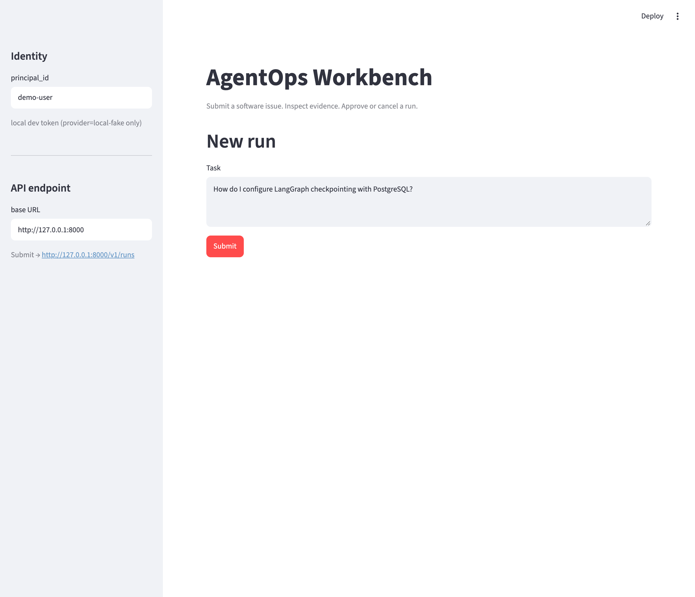
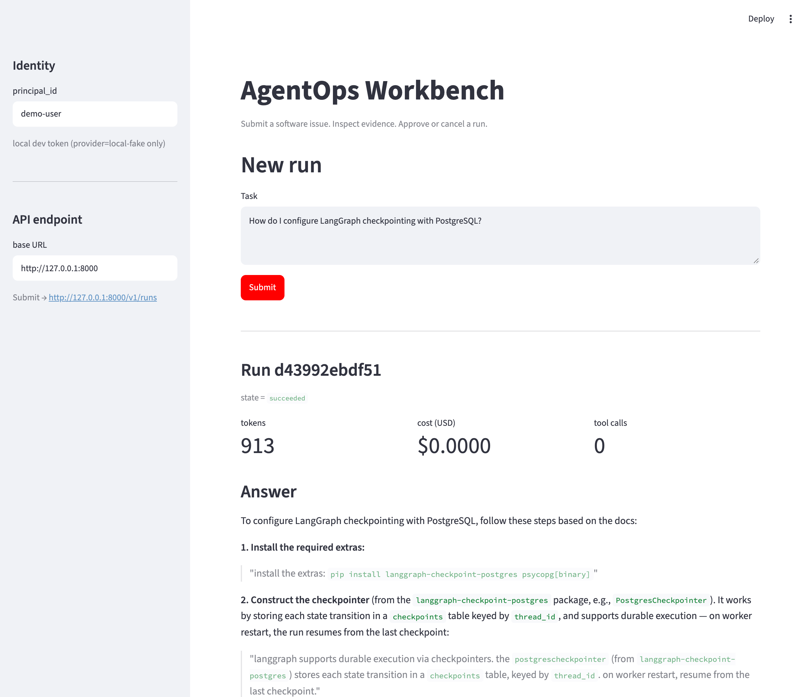

# AgentOps Workbench

> Lives at `apps/agentops-workbench/` inside `sh-ai-x/AgentOpsPipeline`.
> All commands below assume you are in this directory.

A support-operations agent that turns a software issue into a grounded
answer and an approval-gated ticket draft, plus an experiment workbench
that compares prompt / topology / tool-integration choices on a 30-case
human-reviewed benchmark.

## Quickstart

```bash
# Requires uv (https://docs.astral.sh/uv/)
uv sync --extra dev
cp .env.example .env  # edit MINIMAX_API_KEY for live experiments
uv run pytest -q
uv run ruff check .

# Run the held-out experiment (local-fake, deterministic):
AGENTOPS_PROVIDER=local-fake uv run python -m agentops_workbench.experiments.run_held_out

# Bring up the API + UI:
AGENTOPS_PROVIDER=minimax uv run uvicorn agentops_workbench.api.server:app --port 8000
AGENTOPS_PROVIDER=minimax uv run streamlit run streamlit_app/app.py
```

## Live provider setup

`provider=local-fake` is the dev default; `provider=minimax` is the live default for live experiments. A working
`MINIMAX_API_KEY` lives at `/Users/sanghee/dev/dev-harness-kit/.env`
(variable name `MINIMAX_API_KEY`). Copy that value into this app's
`.env` (gitignored). CI uses `provider=local-fake` and needs no key.

**Never commit a populated `.env`.**

## Screenshots

The Streamlit UI is the primary operator surface. Both screenshots are
captured via `scripts/screenshot_streamlit.py` (Playwright driving the
system Chrome via channel=`chrome`; no playwright-bundled browser
download required).

| Step | Capture |
|------|---------|
| Operator opens the UI; default task is pre-loaded; the dev-token path auto-mints for `provider=local-fake` |  |
| After clicking **Submit**, the run panel shows state/tokens/cost/tool-calls and the synthesized answer that quotes doc-001 + doc-002 from the corpus |  |

To regenerate after a UI change:

```bash
# 1) Make sure both servers are up:
AGENTOPS_JWT_SECRET="<strong-32+>" AGENTOPS_ALLOW_DEV_TOKEN=1 \
  uv run uvicorn agentops_workbench.api.server:app --port 8000 &
AGENTOPS_JWT_SECRET="<strong-32+>" AGENTOPS_ALLOW_DEV_TOKEN=1 \
  uv run streamlit run streamlit_app/app.py &

# 2) Drive headless Chrome and write the new PNGs into docs/screenshots/:
uv run python scripts/screenshot_streamlit.py
```

## Architecture

```
task -> [retrieve] -> [classify] -> (answer | refuse | clarify)
                                       |
                                       v
                                  answer + ticket draft
                                       |
                                       v
                              POST /v1/actions/{id}/approve
                                       |
                                       v
                              publish_ticket (mock ledger)
```

- **LangGraph** (`langgraph==1.2.11`): fixed graph (default), single-agent and bounded planner/executor variants behind a single `run_topology(name, ...)` registry (ADR-0006 ships the fixed graph)
- **MCP** (`mcp==2.2.0`, spec `2026-07-28`): custom document server over stdio + pinned `@modelcontextprotocol/server-filesystem` (fixture-only scope)
- **FastAPI**: `POST /v1/runs`, `GET /v1/runs/{id}`, `POST /v1/runs/{id}/cancel`, `POST /v1/actions` (HS256 JWT, `AGENTOPS_JWT_SECRET` in `.env`)
- **SQLAlchemy + SQLite** (Postgres in prod): runs / tool_calls / actions
- **Streamlit UI**: submit / inspect / approve / cancel
- **OTel**: spans + redacted trace export (`runs/<id>/trace.otel.jsonl`)
- **Provider**: `{openai, anthropic, minimax, local-fake}` behind `LLMAdapter`; graph code never names a provider

## Dataset

30 cases split **18 dev / 6 val / 6 held-out**, 6 task families
(straightforward, multi_doc, ambiguous, missing_evidence, stale_doc,
tool_failure). Held-out set is content-hashed into
`fixtures/cases/HELD_OUT_SHA256.txt` and frozen before Phase 3 tuning.

## Evaluation

Run `uv run python -m agentops_workbench.experiments.run_held_out` to
produce `experiments/held-out-v1/{outcomes.jsonl, manifest.json,
failed_cases.md, uncertainty.md}`. SpendCeiling (default $5.00) is
enforced before execution.

## Code layout

```
src/agentops_workbench/
  api/server.py              # FastAPI + JWT
  benchmark/{scorers,load}.py
  db/{models,session}.py
  experiments/{held_out,run_held_out}.py
  graph/{fixed,single_agent,planner_executor,topology,state}.py
  llm/{adapter,factory,local_fake,minimax,openai_compat}.py
  mcp/mcp_servers/{document,filesystem}/...
  mocks/tickets.py           # idempotent mock ledger
  observability/otel.py      # Tracer + redact
docs/
  scope.md                   # in/out scope
  RUNBOOK.md                 # bring up + clear ledger + read trace
  EVIDENCE_CARD.md           # what we built + what we measured
  demo.md                    # 5-minute demo script
  adr/0001..0006-*.md        # design decisions
fixtures/
  cases/{dev,val,held_out,pilot}/case-*.json
  docs/doc-001..008-*.md
  llm/scripts/default.jsonl
docker/
  docker-compose.yml         # postgres + api + worker + streamlit + mcp-document
  Dockerfile
```

## Tests

```bash
uv run pytest -q     # 154 tests
uv run ruff check .  # clean
```

## References

- Proposal: `../../docs/proposals/agentops-workbench-proposal.md`
- Proposal HTML: `../../docs/proposals/accepted/agentops-workbench/main.html`
- Plan: dev-harness-kit `.dev-kit/round-1/{PRD.md, phases/build/step1..7.md}`

## License

MIT. See `LICENSE`.
