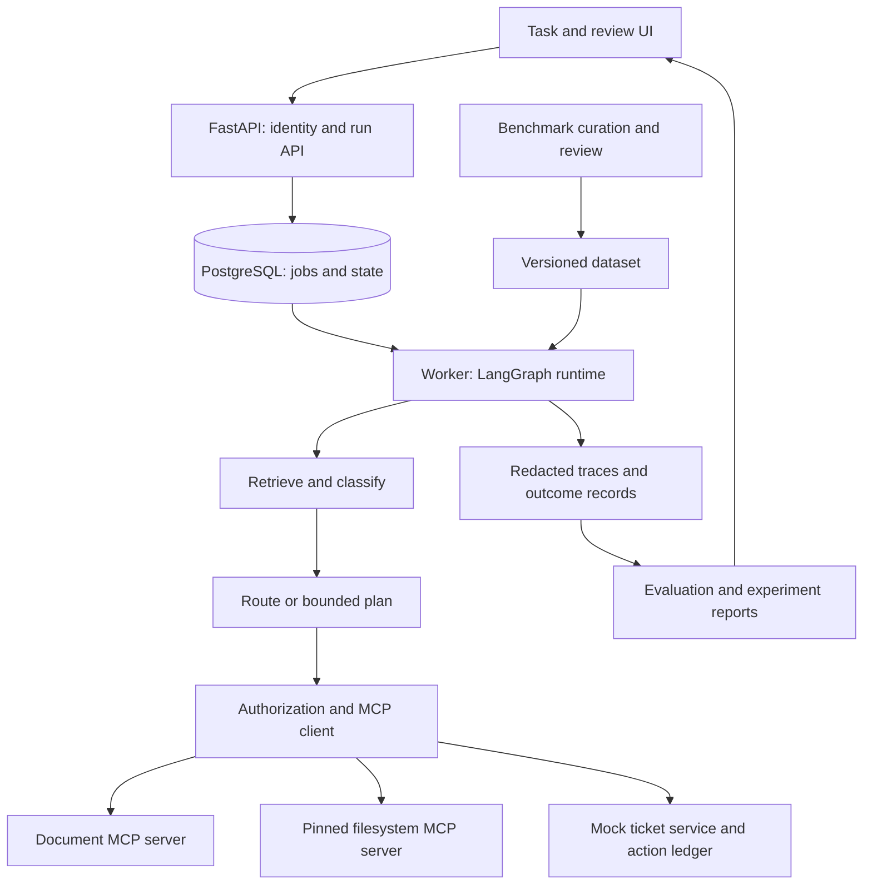

# AgentOps Workbench

English design proposal · September 8, 2026 · Main target: AI Agent / Applied AI Engineer

## What You Are Building

A support-operations agent that turns a software issue into a grounded answer and a ticket draft, plus an experiment workbench that measures prompt, workflow and tool-integration choices. Users submit an issue, inspect evidence and approve an exact ticket action. Engineers compare configurations on the same domain benchmark.

The contribution is a complete application and a defensible optimization study. It is not a new general-purpose agent framework. Use LangGraph from the first release, LangChain integrations, and real MCP protocol calls to local controlled services.

## Why This Portfolio Supports Interviews

The supplied job asks for five connected abilities. This project gives one visible artifact for each: prompt experiment, topology comparison, node/task scorecard, benchmark curation and tested MCP integration. Python server behavior and delivery are demonstrated in the same application.

AgentOps asks which workflow should be shipped and why. Share run IDs, trace export and reviewed cases. Implement one repository; avoid building duplicate trace explorers or workers.

## User Story and Scope

An engineering support user submits a repository issue. The system retrieves versioned documentation, asks for clarification when necessary, proposes a supported answer and optionally creates a ticket draft. Publishing occurs only to a local mock ticket service after server-validated approval.

MVP tools: `search_docs`, `read_document`, `get_issue`, `create_ticket_draft`, `publish_ticket`. The document service is a custom MCP server. Integrate **one pinned existing MCP server**: `@modelcontextprotocol/server-filesystem` against a synthetic read-only fixture directory. Do not grant unrestricted local filesystem access.

Task families: straightforward answer, multi-document answer, ambiguous request, missing evidence, conflicting/stale documentation and tool failure. Multi-agent behavior is an experimental variant, not a requirement for every task.

## Tech Stack

| Component | Choice | Reason / boundary |
|---|---|---|
| Language | Python, uv, Pydantic, pytest, Ruff | Typed contracts and reproducible setup; pin tested versions |
| Orchestration | LangGraph | Explicit state, conditional routing, checkpoints, interrupts/resume |
| Model integration | LangChain chat-model wrapper per provider; single `LLMAdapter` interface | Provider-agnostic graph; swappable via `provider`/`model` config; fake provider for CI |
| MCP | Official Python SDK; custom document server + `@modelcontextprotocol/server-filesystem` (version-pinned, fixture-only scope) | Demonstrates integration and development; adopt a documented protocol revision |
| API | FastAPI, Bearer/JWT auth | Run, approval; CLI for experiments and dataset review in MVP |
| Persistence | PostgreSQL, SQLAlchemy, Alembic | Jobs, checkpoints, action ledger, dataset and experiment metadata |
| Retrieval | Lexical baseline | Compare retrieval before adding infrastructure (pgvector deferred) |
| Evaluation | pytest, JSONL fixtures, Python analysis | Transparent outcome checks and experiment manifests |
| Tracing | OpenTelemetry only | Correlate model calls, tools, state transitions and failures |
| UI | Streamlit | Submit tasks, approve actions and compare runs without a large frontend project |
| Delivery | Docker Compose, GitHub Actions | Offline CI and a reproducible demo |

**Out of scope for MVP**: fine-tuning, Kubernetes, autonomous deployment, ML router baseline (TF-IDF/logistic regression), LangSmith export, A2A, second SDK, vector search, benchmark candidate generator pipeline, UI polish.

## Architecture



## Auth and Identity

FastAPI Bearer token (HS256 JWT, dev secret in `.env`). `principal_id` claim drives identity.

Authentication supplies the principal; the model cannot choose one. Authorize documents and tools using that identity. Model-generated arguments are untrusted. Check current permissions and approval immediately before effects, not just during planning.

## Provider and Model Abstraction

Config-driven: `provider ∈ {openai, anthropic, minimax, local-fake}`, `model=<id>`. A single `LLMAdapter` interface returns normalized usage (`provider, model, prompt_tokens, completion_tokens, total_tokens, cost_usd`). LangChain chat-model wrapper per provider. **No provider-specific code paths in the agent graph.** Default for development and CI: `provider=local-fake`. Live provider configured per experiment via environment or manifest.

This shape lets you ship with MiniMax today and swap to OpenAI or Anthropic later without touching the workflow code.

## Contracts and APIs

```text
Run: id, principal_id, state, graph_version, prompt_version,
     model_config, budget, code_sha, trace_id
ToolCall: id, run_id, tool_name, policy_decision, action_key, outcome, latency
BenchmarkCase: id, family_id, source_refs, task, expected_outcome,
               allowed_tools, reviewer, split
Experiment: id, dataset_version, config_hash, code_sha, trial_ids,
            token_usage, cost_estimate, started_at

POST /v1/runs                   GET /v1/runs/{id}
POST /v1/runs/{id}/cancel       POST /v1/actions/{id}/approve
```

CLI for experiments and benchmark review.

Use object authorization on every run/action lookup. Approval binds user, run, tool, canonical arguments, expiry and one-use nonce. Cancellation stops future work and reports already-completed actions; it does not imply rollback of external effects.

Use queued → running → waiting_for_approval → succeeded/failed/cancelled states. Persist checkpoints and durable job leases. On worker restart, recover expired claims. Tool calls use stable action keys; after a crash following dispatch, query the mock ledger before retrying. Checkpointing alone cannot guarantee exactly-once external effects.

MCP integration tests cover discovery, schema validation, timeout, malformed results, unsupported capabilities and server disconnect. Keep credentials out of prompts and trace payloads. Separate local stdio setup from authenticated remote transport; follow the selected transport's protocol requirements rather than assuming they are interchangeable.

## Evaluation and Optimization Design

Start with 12 manually reviewed pilot tasks. Target **30 total cases** across six families, split **18 development / 6 validation / 6 held-out**, grouped by source-document and scenario template. Keep near-duplicates together. Tune only on development/validation; freeze the held-out set before final selection.

Cases are reviewed manually by a human reviewer who records provenance and split. A synthetic candidate generator pipeline is deferred to a later phase.

Compare three execution variants: fixed graph, single tool-using agent and bounded planner/executor. First compare three prompts under a fixed graph; choose using validation. Then compare topologies using that prompt family, model, corpus, tool permissions and budgets. Label this staged selection and its interaction limitation; a full factorial search is optional.

Use deterministic outcome checks first; an optional isolated LLM judge scores groundedness on a human-reviewed subset and cannot grant permission or promote labels.

| Metric | Definition | Proposed release criterion |
|---|---|---|
| Task success | Cases satisfying the allowed end-state oracle / all attempted cases | Report raw counts by family; select an improvement only when evidence supports it |
| Retrieval recall@k | Relevant source IDs retrieved / gold relevant source IDs | Report independently of generation scores |
| Tool correctness | Calls with correct allowed tool and arguments / scored calls | Include valid-schema but incorrect-meaning failures |
| Reliability | Recovery, timeout/cancel and duplicate-effect behavior | All defined deterministic critical tests pass |
| Cost/latency | Tokens and estimated cost per attempted and successful task; p50/p95 latency | Compare under common caps; retain timeouts in success denominators |
| Benchmark quality | Reviewed acceptance/correction/duplicate rate and family coverage | Every promoted case has reviewer and split |
| Security | Cross-scope access and unauthorized mock actions completed | Zero escapes in the specified deterministic suite; no universal guarantee |

All numbers are design targets, not achieved results. Record repeated live trials and paired case-level differences; use case-family-aware uncertainty where sample size permits. The held-out set is small (6 cases) by design — interpret results as illustrative, not statistically settled. Extra trials of one case do not create independent scenarios. Temperature zero does not guarantee reproducibility.

Suggested final experiment: **6 held-out cases × 2 selected topologies × 2 trials = 24 runs**, after a small cost pilot. Configure a spend ceiling before execution using actual provider rates. Shrink the sample and state the limitation if budget is insufficient. Deterministic fake-response CI checks control flow, not live-model quality.

## Step-by-Step Build Guide

### Phase 0: Scope and Ground Truth — Week 1, first half

1. Define one user workflow, useful outcomes, permissions and excluded features.
2. Create 12 pilot tasks and source documents with explicit expected outcomes.
3. Design typed run/tool/case contracts and baseline experiment manifest.
4. Write ADRs for LangGraph, MCP boundaries, provider abstraction, dataset separation.

Deliverables: scope, fixture schema, pilot dataset, architecture. Exit: another developer can score the pilot without guessing what "good" means.

### Phase 1: Runnable Agent and API — Weeks 1–2

1. Implement fixed LangGraph retrieval → classification → answer/draft workflow using a LangChain chat-model wrapper; provider-agnostic.
2. Add FastAPI run creation/status, durable state, Bearer/JWT auth, and live + fake model adapters behind `LLMAdapter`.
3. Add bounded steps, deadlines, cancellation and explicit insufficient-evidence responses.
4. Build the mock ticket ledger and basic UI; test normal and failed requests.

Deliverables: clean-checkout demo and typed API. Exit: normal task completes, missing evidence produces a supported refusal/clarification, failed tool is visible. Start applications with this slice.

### Phase 2: MCP and Reliable Tool Use — Week 3

1. Implement the document MCP server and integrate `@modelcontextprotocol/server-filesystem` (pinned version, fixture-only scope).
2. Add call validation, timeouts, capability handling and error normalization.
3. Enforce identity/scope and action-bound approval before publishing.
4. Exercise restart, duplicate delivery, malformed results and unauthorized direct calls.

Deliverables: server/client contract suite and recovery report. Exit: tools work through the protocol and a repeated action does not duplicate the mock effect.

### Phase 3: Benchmark Curation and Prompt Experiments — Week 4

1. Manually curate 30 cases across the six families; review expected outcomes.
2. Freeze dataset splits; record per-case provenance and reviewer.
3. Implement node/task scorers.
4. Compare three prompt versions on validation; publish one unsuccessful change.

Deliverables: dataset card, review record and prompt report. Exit: every promoted case is traceable and held-out data has not influenced tuning.

### Phase 4: Topology and Planning Experiments — Week 5

1. Add single-agent and bounded planner/executor variants using the same tool contracts.
2. Apply identical budgets, corpus and permissions; implement stop/escalation conditions.
3. Compare success, call count, cost and latency; inspect cases where planning harms performance.
4. Choose a shipping configuration on validation and record its limitations.

Deliverables: topology comparison and ADR. Exit: selection follows measured utility; a simpler workflow may win.

### Phase 5: Failure Evidence and Delivery — Weeks 6–7

1. Export redacted OpenTelemetry traces.
2. Turn one reviewed failure into an executable regression.
3. Finish recovery, scope isolation and approval replay tests.
4. Package containers, migrations, offline CI and an operator runbook.

Deliverables: reproducible release and failure-to-test walkthrough. Exit: a clean setup works, seeded regression fails CI and traces do not expose synthetic secrets.

### Phase 6: Held-Out Evaluation and Portfolio — Week 8

1. Freeze chosen configurations and run the budgeted held-out experiment.
2. Publish raw outcomes, manifests, failed cases and uncertainty.
3. Record a five-minute demo: task → MCP calls → result → comparison → regression.
4. Write a concise evidence card with personal contributions and measured results only.

Deliverables: release, report, recording and résumé evidence. Exit: a reviewer can reproduce an offline failure and inspect the basis for the shipping decision.

## Schedule Cuts and Presentation

Cut UI polish, vector search, ML router baseline, benchmark candidate generator first. If time is short, keep a fixed graph and one agent variant with 30 reviewed cases, label the smaller experiment and finish the complete loop. Do not claim improvements before measuring them.

Résumé template after implementation: "Built a LangGraph/FastAPI support agent integrating [N] MCP servers; compared [K] workflow configurations on [M] held-out scenarios and shipped [configuration] based on task success, recovery, latency and cost." Fill placeholders only from published results.

## References

- [LangGraph](https://docs.langchain.com/oss/python/langgraph/overview) — runtime reference.
- [MCP architecture](https://modelcontextprotocol.io/docs/learn/architecture) — integration contract reference.
- [Study competency map](../topic/06-agent-engineer-competency-map.md) — preparation context.