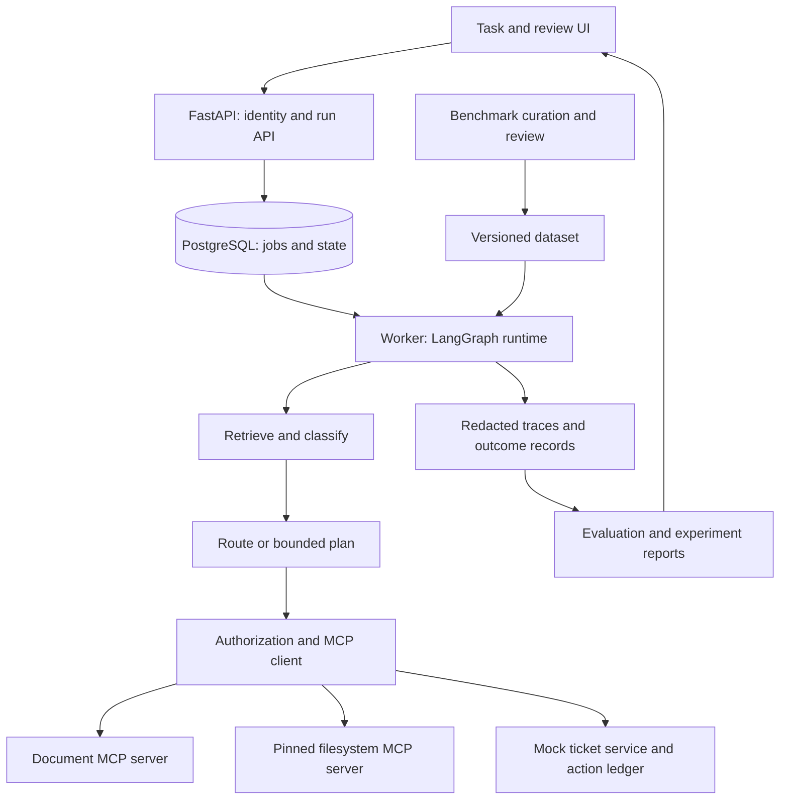
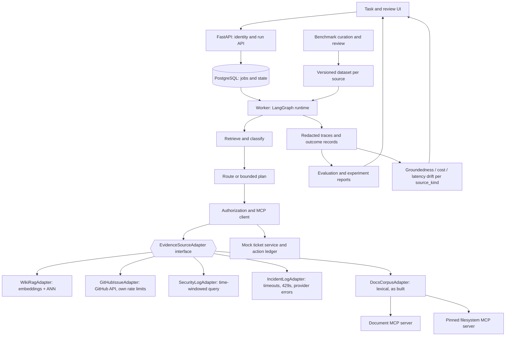

# AgentOps Workbench

English design proposal · September 8, 2026 · Main target: AI Agent / Applied AI Engineer

## What You Are Building

A support-operations agent that turns a software issue into a grounded answer and a ticket draft, plus an experiment workbench that measures prompt, workflow and tool-integration choices. Users submit an issue, inspect evidence and approve an exact ticket action. Engineers compare configurations on the same domain benchmark.

The contribution is a complete application and a defensible optimization study. It is not a new general-purpose agent framework. Use LangGraph from the first release, LangChain integrations, and real MCP protocol calls to local controlled services.

## Why This Portfolio Supports Interviews

The supplied job asks for five connected abilities. This project gives one visible artifact for each: prompt experiment, topology comparison, node/task scorecard, benchmark curation and tested MCP integration. Python server behavior and delivery are demonstrated in the same application.

AgentOps asks which workflow should be shipped and why. Share run IDs, trace export and reviewed cases. Implement one repository; avoid building duplicate trace explorers or workers.

## Pivot (2026-09-13): Open-Source Maintainer Tooling, Adapter-Generalized Evidence Sources

> **Amendment, not a rewrite.** Everything below this section — §"What You
> Are Building", §"User Story and Scope", the six task families, the Phase
> 0–6 build guide — is the **historical record of what was actually built
> and merged** (see [`phases/index.md`](../../phases/index.md) and
> [`phases/build-report.md`](../../phases/build-report.md)). It is left
> intact on purpose. This section states what supersedes it going forward
> and why, in the same place a reader will look for the project's current
> framing.

### What changes

The original framing — *"a support-operations agent that turns a software
issue into a grounded answer and a ticket draft"* — is **retired from the
portfolio narrative**. The reason is not technical: the operator has no
domain expertise in customer support and therefore cannot credibly judge
whether an answer is good, which makes every quality claim built on that
framing indefensible in an interview. A benchmark whose owner cannot grade
its own gold labels is not evidence.

It is superseded by a **developer-tooling / open-source-maintainer**
framing. The same three inputs the system already handles (an issue, a
searched corpus, a run's own trace) are a far better fit there:
*GitHub Issue analysis + wiki RAG + prompt-log analysis* is not support
operations. It is automation and observability for open-source and DevOps
tooling — a domain the operator does work in and can defend.

### What does not change

The architecture carries forward largely unchanged: LangGraph topologies
(`fixed` / `single_agent` / `planner_executor`), real MCP tool execution,
the FastAPI run/approval surface, the `LLMAdapter` provider abstraction,
OpenTelemetry tracing, and the benchmark harness with its frozen splits.
Phases 0–6 are not re-planned and their audit findings stand.

**One seam generalizes: the evidence source.** Today the graph reaches
evidence through a single `DocumentClient` Protocol backed by a fixed
`fixtures/docs/*.md` corpus. That Protocol becomes a named
`EvidenceSourceAdapter` pattern with per-deployment implementations —
`WikiRagAdapter`, `GitHubIssueAdapter`, `SecurityLogAdapter`,
`IncidentLogAdapter` — selected by configuration, exactly the way
topologies and LLM providers already are. Mechanics, the deliberate method
rename, the per-adapter cost and the staged migration are in
[**ADR-0007: Evidence-source adapter pattern**](../../apps/agentops-workbench/docs/adr/0007-evidence-source-adapter-pattern.md).
Execution is tracked as [Phase 7](../../phases/07-adapter-pattern-pivot/index.md).

The pattern is not invented here. `DocumentClient` is already an
adapter-shaped seam that `graph/planner_executor.py` consumes by Protocol
(PR #21, merged), and PR #29 (open) adds `SubprocessDocumentClient` as a
second real implementation of it. The pivot names the pattern and adds
siblings for non-document sources; it does not start from nothing.

### Pillar 1 — Open Source Maintainer Helper Agent

An external contributor files a GitHub Issue on a repository. The agent
retrieves the project's own wiki / technical documentation, produces a
grounded answer or triage draft with citations, and refuses when the
evidence does not support an answer. Value: a maintainer answering the
same question for the twentieth time gets a cited draft instead of a blank
box.

Mapped onto what exists, rather than restated as ambition:

| Old framing's role | Post-pivot role | Backed by |
|---|---|---|
| `get_issue` (a prompt string only — never a real tool; see `build-report.md`) | `GitHubIssueAdapter.read_evidence()` — the task input itself | new, ADR-0007 §3 |
| `search_docs` / `read_document` over `fixtures/docs/` | `WikiRagAdapter.search_evidence()` / `read_evidence()` | generalizes the existing Protocol |
| `create_ticket_draft` / `publish_ticket` (never implemented as tools) | triage / answer draft through the existing approval path: `POST /v1/actions/{id}/approve` → `TicketLedger.publish()` (PR #30, open, wires the execute half) | existing surface |

Topology: `planner_executor`, the variant that already receives a
`DocumentClient` through graph state and records per-call `tool_results`
(PR #21, merged). "Issue in → wiki evidence out → cited draft" is a
plan-then-retrieve-then-synthesize shape, which is what that topology
does. Note the honest caveat: ADR-0006 selected the **fixed** graph as the
default, and that selection was made over the synthetic corpus with
stubbed tools. ADR-0007 scopes ADR-0006's decision to the docs corpus;
the topology choice must be re-measured per evidence source, and
`graph/fixed.py` — which reads `fixtures/docs/` directly — cannot consult
a GitHub issue at all without change.

### Pillar 2 — Prompt Observability & Eval

**The substrate is already shipped. Naming it accurately matters more than
claiming it as new work.** What exists today:

- `llm/adapter.py:Usage` — normalized `provider, model, prompt_tokens,
  completion_tokens, total_tokens, cost_usd` per model call, from every
  adapter.
- `db/models.py:ToolCall` — persisted `{tool_name, policy_decision,
  action_key, args_canonical, outcome, latency_ms}` rows with real
  args-based idempotency keys.
- `graph/planner_executor.py:_execute_node` — per-call
  `{tool_name, outcome, latency_ms, error_kind}` accumulated into
  `tool_results` (PR #21, merged; PR #25 open with review fixes; PR #26
  open, extends the same to `single_agent`).
- `classify_mcp_error` — failures bucketed into
  `timeout / disconnect / malformed / unsupported_capability /
  permission_denied`.
- OpenTelemetry span export, and the frozen-manifest experiment runner.

So tokens, cost, latency, tool outcome and trace already flow. The **new**
work is the quality and drift layer on top:

1. **Answer-groundedness scoring over time.** The current `task_success`
   scorer is exact-substring match against a human-written expected
   outcome — `build-report.md` records it as conservative, and the
   held-out run reports `0/24`. Groundedness ("is every claim in the
   answer traceable to a retrieved `EvidenceRef`?") is the metric that
   actually generalizes across evidence sources, because a substring oracle
   does not survive a log-aggregate citation.
2. **Cost / latency drift detection.** The per-run `Usage` and `ToolCall`
   rows are already a time series; nothing reads them as one. Detecting
   that p95 latency or cost-per-successful-task regressed after a prompt
   or provider change is a reducer over data that exists, not new
   instrumentation.
3. **Per-source metric segmentation.** Once adapters exist, every metric
   is reported per `source_kind`. Pooled numbers across a wiki and a log
   source would be meaningless.

*Related prior art, not the same initiative:* repo issue
[#22](https://github.com/sh-ai-x/AgentOpsPipeline/issues/22) proposes a
`claim_fidelity` measurement — `claim.made` / `claim.audit` events and a
`false_positive_rate = refuted / audited` reducer — for **dev-kit's own
harness effectiveness**, i.e. whether a *build agent's* completion claims
about the harness are true. It shares the independent-verification
mechanism with this pillar and nothing else: different event stream,
different subject (the harness, not this agent's answers), different
consumer. Cited here so the lineage is visible; its scope is not absorbed
into this proposal and neither one's numbers should be quoted for the
other.

### Pillar 3 — ROI in the open-source ecosystem

The claim: a maintainer spends a large, recurring share of issue-triage
time re-answering questions the project's own documentation already
answers. An agent that drafts a cited answer converts that from writing to
reviewing.

**Illustrative arithmetic — not a measured result.** Every number below is
a placeholder for the shape of the argument, and none of it belongs on a
résumé until measured:

> *Illustrative only.* 40 issues/month × 50% already-documented ×
> 10 min/answer ≈ 3.3 maintainer-hours/month. At the workbench's observed
> live cost of **$0.0124 for 24 runs** (`experiments/held-out-v1/`,
> `MiniMax-M3`), the model spend for 40 drafts is cents. The economics are
> not the question; answer quality is.

What would actually validate it — this project's own benchmark methodology
turned on itself, which is the only honest way to make an ROI claim in a
portfolio:

1. A reviewed benchmark of **real** issues from a real repository, with
   gold answers and gold evidence, curated under
   [ADR-0004](../../apps/agentops-workbench/docs/adr/0004-dataset-separation.md)'s
   frozen-split discipline, with reviewer and split recorded per case.
2. **Draft-acceptance rate**: what fraction of drafts a maintainer posts
   with no edit, minor edit, or discards. This is the ROI metric.
   Time-saved is downstream of it and must not be reported without it.
3. **Groundedness and refusal correctness** on the same set — a confidently
   wrong cited answer costs a maintainer *more* time than a blank box,
   which is the failure mode this claim has to survive.
4. Cost per accepted draft from the `Usage` rows, and the same
   uncertainty discipline §"Evaluation and Optimization Design" already
   imposes: small samples are illustrative, not statistically settled.

Until (1)–(4) exist, the ROI story is a stated hypothesis with a named
falsification test, and it is presented that way.

### Out of scope for the pivot

Generic customer support and general end-user ticketing, in any framing.
The operator cannot judge answer quality in that domain, so no claim built
on it is defensible. Excluded from the portfolio narrative permanently —
not deferred.

## Update 2 (2026-09-13): One Flagship GitHub-URL Flow, Backend-First, Deployable

> **Second dated addendum. It builds on §"Pivot (2026-09-13)" (Update 1,
> PR #32); it does not replace it.** Update 1 retired the
> customer-support framing and generalized the evidence seam into an
> `EvidenceSourceAdapter` pattern. Both decisions stand. This update
> changes neither. It adds two things Update 1 left open: **which single
> flow is the demo**, and **where the backend actually runs**.
>
> **Merge-order note (resolved).** This section was written to sit
> immediately after §"Pivot (2026-09-13)" while PR #32 was still open;
> merging both produced exactly the predicted "both added" textual
> conflict at that insertion point, resolved exactly as predicted — Update
> 1 first, this section directly after, both otherwise unchanged. PR #32
> and PR #33 are now both merged; this section (and ADR-0008, alongside
> ADR-0007) landed via the consolidated PR that reconciled that conflict.
>
> Third planning iteration on this pivot in one day. The first two
> iterations (PRs #32, #33) are narrative and pattern work; PR #34 is the
> implementation that made this iteration possible to write concretely
> instead of aspirationally.

### What changed since Update 1, in the code

Update 1 described five adapters as future work. **PR #34 built them, with
tests.** `src/agentops_workbench/adapters/` now contains a real
`EvidenceSourceAdapter` Protocol plus `WikiRagAdapter` (pure-Python
TF-IDF/cosine retrieval over a directory of `.md` files),
`GitHubIssueAdapter` (real `httpx` calls to GitHub REST v3),
`SecurityLogAdapter`, `IncidentLogAdapter` and `TicketSystemAdapter`. They
are not wired into `graph/**` yet, by design.

That changes what this proposal can honestly claim, in both directions:

- The adapters are no longer a plan, so a flow built on two of them can be
  specified against real constructor signatures rather than sketched.
- The implemented `EvidenceRef` is `(ref_id, title, score, source_kind,
  retrieved_at)` — it **dropped the `uri` field** that
  [ADR-0007](../../apps/agentops-workbench/docs/adr/0007-evidence-source-adapter-pattern.md)
  §2 specified, and `read_evidence` takes `ref_id`, not `evidence_id`.
  Recorded here rather than quietly reconciled: a citation therefore has
  no self-describing link, and whatever renders a citation has to supply
  one. The flow below does exactly that, and
  [ADR-0008](../../apps/agentops-workbench/docs/adr/0008-github-url-cli-and-deployment-target.md)
  records it as a known divergence to close later.

### Product scope reduction: one flow, not five adapters

The five adapters stay in the codebase as the general-purpose foundation.
**The product scope narrows to one docs-only flow** — a demo script a
reviewer can run, rather than an abstraction a reviewer has to be
talked through:

```
agentops-oss-helper <github-repo-url> [--question "..."]
```

Paste a public GitHub repository URL and optionally a free-text question.
The tool works off **that repository's own docs/README** and produces a
grounded answer with a citation behind every claim — or an explicit
refusal when the evidence does not support one.

> **Scope reduced from "Issues + PRs + docs" to "docs only" on 2026-09-15.**
> The original two-source design (Issues/PRs from the GitHub REST API +
> docs/README from `WikiRagAdapter`) was excluded for the `oss-helper`
> flagship flow because anonymous GitHub `/search/issues` is constrained
> to 60 req/h per IP and refuses with 422 on popular or large repos —
> making the demo fail on the very targets it was meant to demonstrate.
> The four other adapters (SecurityLog, IncidentLog, TicketSystem, plus
> WikiRagAdapter itself) remain as the general-purpose pattern. See
> [ADR-0009](../adr/0009-oss-helper-docs-only-scope.md) for the full
> rationale.

**Local-first.** There is no hosted multi-tenant service behind this flow.
A maintainer clones this repo and points the CLI at their own
repository. Zero GitHub-token setup required for the docs-only flow on
small and medium public repos. The deployed API (below) is a *second*,
independent surface that exists to prove the backend deploys — it is
not where this flow is expected to be consumed.

"Here are five adapters, pick one" is not a demo. This is.

### How the flow actually runs, step by step

#### 1. Parse the URL

Accept `https://github.com/<owner>/<repo>`, with or without `.git` or
a trailing slash. Anything else is rejected before any network call.
`owner` and `repo` are what `WikiRagAdapter(wiki_dir=...)` needs to
bulk-acquire the repo's docs.

> The `--issue <N>` / `/issues/<N>` URL path that the original design
> supported is no longer in scope (see the scope-reduction note at the
> top of this section and [ADR-0009](../adr/0009-oss-helper-docs-only-scope.md)).
> The current `oss-helper` flag surface is just `--question "..."`.

#### 2. Acquire the repo's docs — by bulk download, not by API

**Decision: fetch the repository's markdown in bulk (one shallow clone or
one tarball) and use *no* other network source.** This is not a
preference; one fact forces it:

- **The retrieval math forces bulk acquisition.** `WikiRagAdapter.__init__`
  reads every `*.md` in its directory and builds a corpus-wide document-
  frequency table (`self._df`, `self._n_docs`) before any query runs. IDF
  is *by definition* a property of the whole corpus. A per-query API
  fetch cannot produce it — you would be scoring against an IDF table
  of one document. Bulk-first is a constraint of the algorithm already
  shipped, not a shortcut.

(The original design's secondary GitHub-API source for issues and
PRs was dropped per [ADR-0009](../adr/0009-oss-helper-docs-only-scope.md)
because anonymous GitHub API access to `/search/issues` is rate-limited
at 60 req/h per IP and refuses with `422 Validation Failed` on popular
or large repos, making the demo fail on the very targets it was meant
to demonstrate. The four other adapters remain in the codebase as
the general-purpose Adapter pattern, just unused by `oss-helper`.)

Cost comparison, for the record: enumerating a tree and fetching N blobs
is N+1 REST calls against the same 5000/hour authenticated budget the
issue search draws from, whereas a git fetch or a `codeload` tarball is
one transaction that does not consume the REST quota at all.

Two acquisition paths, same output directory:

| Environment | Mechanism | Why |
|---|---|---|
| Local CLI (git present) | `git clone --depth 1 --filter=blob:none --sparse`, then `git sparse-checkout set README.md docs doc documentation CONTRIBUTING.md` | Smallest transfer on a large repo; blobs fetched only for the paths asked for |
| Container / no git binary | `GET https://codeload.github.com/<owner>/<repo>/tar.gz/<ref>`, extracted to the same temp dir | One HTTP request, no `git` in the image, no `.git` directory left behind |

(The original design's secondary GitHub-API source for issues and
PRs is dropped per [ADR-0009](../adr/0009-oss-helper-docs-only-scope.md).
The remaining bulk-acquisition path is unchanged.)

**Flattening is required, and it is easy to get wrong.**
`WikiRagAdapter` globs `*.md` **non-recursively**, and a real repository's
documentation is nested (`docs/guide/install.md`). The materializer
therefore walks the checkout and, for each `*.md`/`*.mdx` under the
allowlisted roots, writes a flattened copy into one temp directory with
path separators encoded into the stem (`docs__guide__install.md`). It keeps
a stem → `(repo path, commit sha)` map so a citation can be rendered as
`https://github.com/<owner>/<repo>/blob/<sha>/docs/guide/install.md`. That
map is how the missing `EvidenceRef.uri` is supplied without changing the
adapter.

**Caps, stated up front.** The TF-IDF index is built in-process in pure
Python and scoring is a linear scan over every document per query. That is
appropriate at hundreds of documents and inappropriate at tens of
thousands. The CLI refuses above a default cap (order of a few hundred
markdown files / a few MB of text), raisable with `--max-docs`, with an
explicit message naming the cap. A monorepo must fail loudly, not wedge.

#### 3. Construct the adapter

- `WikiRagAdapter(wiki_dir=<flattened temp dir>)` — `source_kind="wiki"`.

(No second adapter in the current `oss-helper` scope. The original
two-source design paired this with `GitHubIssueAdapter` for issues/PRs;
that adapter remains in the codebase per phase 7 / ADR-0007 as part of
the Adapter pattern demonstration, but is not used by the flagship
flow. See [ADR-0009](../adr/0009-oss-helper-docs-only-scope.md).)

#### 4. Topology: a new one, and here is why the existing ones do not fit

**Decision: add a new topology `oss_triage` (`graph_version =
"oss-triage-v1"`). Do not reuse `planner_executor` for this flow.**

Four specific blockers in the code as merged, not a general feeling that it
would be cleaner:

1. `run_planner_executor(adapter, task, *, document_client=None)` accepts
   **exactly one** evidence client. This flow has two sources by
   definition.
2. `_execute_step` calls `client.search_docs(...)` / `client.read_document(...)`
   — the *old* `DocumentClient` method names. PR #34's adapters expose
   `search_evidence` / `read_evidence`. **They cannot be passed in as
   `document_client` at all**; they do not satisfy that Protocol.
3. `_PLAN_PROMPT` hardcodes the tool vocabulary
   `search_docs, read_document, get_issue`, and `_execute_step`'s
   `get_issue` branch raises `NotImplementedError` on purpose, normalizing
   to `unsupported_capability`. The one plan step that would read an issue
   is hardwired to fail.
4. `run_topology(name, adapter, task)` has no parameter to forward a client
   through, so the API path always gets a default `InMemoryDocumentClient()`
   over `fixtures/docs/`.

`graph/fixed.py` is worse for this purpose — it reads `fixtures/docs/`
directly, as ADR-0007 already records.

`oss_triage` is a `StateGraph` with four nodes and **one LLM call**:

```
ground_issue -> retrieve_prior_art -> retrieve_docs -> synthesize
```

- `ground_issue` — with `--issue N`, `GitHubIssueAdapter.read_evidence(str(N))`
  supplies the question text; with `--question`, the text is used verbatim.
  No LLM call.
- `retrieve_prior_art` — `GitHubIssueAdapter.search_evidence(query, top_k)`
  over the repo's own Issues and PRs. No LLM call.
- `retrieve_docs` — `WikiRagAdapter.search_evidence(query, top_k)` then
  `read_evidence` on each hit. No LLM call.
- `synthesize` — one LLM call over both evidence blocks, each passage
  labelled with its `source_kind` and `ref_id`, instructed to cite
  `[source_kind:ref_id]` for every claim or emit the existing refusal
  string.

**Why simpler beats the planner here, as an argument rather than a
preference.** With exactly two sources and a fixed question, there is no
routing decision left for a planner to make — the plan is always "search
both, read the top hits, synthesize". An LLM-authored plan would add one
LLM call and a new failure mode (`_parse_plan` returning `[]` routes to
`_empty_plan_node`, i.e. a blanket refusal caused by *parsing*, not by
evidence) in order to produce a constant. One LLM call per invocation also
makes the cost of a demo run predictable, which matters for something a
reviewer runs against a live repository. ADR-0006's fixed-graph finding
points the same way, though ADR-0007 correctly scopes that finding to the
docs corpus.

**Honest limitation, not a reversal.** `oss_triage` is a *baseline*, and it
is the first data point for the per-source topology re-measurement ADR-0007
demands — not a substitute for it. Comparing it against
`planner_executor` is owed work, and it is blocked on two changes to that
topology (accept an `EvidenceSourceAdapter`; derive the plan vocabulary
from the registered adapters instead of hardcoding three names). Until
that comparison runs, no claim of the form "the simple topology wins here"
may be made.

**One adapter change this flow genuinely requires.**
`GitHubIssueAdapter.read_evidence` returns `data.get("body")` only — the
issue's opening comment. A maintainer's actual context usually lives in the
*thread*. The flow needs comment assembly via
`GET /repos/{owner}/{repo}/issues/{n}/comments`, which the adapter does not
call today. This is the one code change to PR #34's adapters that the
flagship flow cannot be built without.

**A trap that falls straight out of reading both adapters.** `score` means
different things per source: GitHub's search relevance score is unbounded
and opaque, `WikiRagAdapter`'s is a cosine similarity in `[0,1]`. **These
must never be merge-sorted into one ranked list.** Retrieve top-k per
adapter independently and present both blocks to the synthesizer, labelled
by `source_kind`. Any future cross-source ranking needs a calibration step
that does not exist.

### This is how Pillar 1 runs — not a fourth pillar

Update 1's §"Pillar 1 — Open Source Maintainer Helper Agent" describes the
capability; this section is its concrete execution. Update 1's Pillar 1
table maps roles onto adapters and names `planner_executor` as the
topology; **that topology choice is superseded by `oss_triage` for this
flow**, for the four coded reasons above. Nothing else in Pillar 1 changes.
Pillars 2 and 3 are untouched: Pillar 2's groundedness and per-`source_kind`
drift work now has a real two-source run to measure, and Pillar 3's
draft-acceptance-rate metric is still unmeasured and still presented as a
hypothesis with a named falsification test.

### Deployment

#### The backend/frontend split is a design property, not an implementation detail

**The backend must be fully exercisable and demoable with no Streamlit
involvement whatsoever.** The target audience for this portfolio is stated
at the top of this document — *Main target: AI Agent / Applied AI
Engineer*. Frontend polish demonstrates nothing to that reader. So the
backend gets three independently sufficient verification surfaces, and the
UI is a thin optional client of the first two:

| Surface | How a reviewer exercises it | Needs Streamlit? |
|---|---|---|
| Test suite | `uv run pytest -q` — graph, adapters and API via `make_test_client()`; no server, no network | No |
| HTTP contract | `curl` `POST /v1/runs` → poll `GET /v1/runs/{id}`; schema from FastAPI's own `/openapi.json` and `/docs` | No |
| CLI | `agentops-oss-helper <url> --issue N` in-process — no API server either | No |

To make that a *verified* property rather than a claim, two concrete
changes are required:

1. **`streamlit` must move out of `[project.dependencies]`** into
   `[project.optional-dependencies] ui = [...]`. It is currently a hard
   runtime dependency, so `uv sync --no-dev` installs it and "the backend
   runs without the frontend" is untested. The API image is then built
   without it, and the deploy smoke test below *passes in an image where
   Streamlit is absent*. That is the falsifiable form of this design
   property.
2. **A console script must exist.** `pyproject.toml` has no
   `[project.scripts]` at all today; the CLI needs
   `agentops-oss-helper = "agentops_workbench.cli.oss_helper:main"`.

#### Target: Fly.io, one container, SQLite on a volume

**Decision: Fly.io.** The reasoning is specific to this application's duty
cycle, which is unusual: near-zero traffic punctuated by long, expensive
requests.

- **Scale-to-zero matches the traffic.** `min_machines_running = 0` with
  auto start/stop means an idle portfolio demo is billed for storage and
  not much else. A platform that keeps a service warm bills continuously
  for a service nobody is calling.
- **It deploys the existing `docker/Dockerfile` unchanged.** `fly deploy`
  builds a Dockerfile directly — no buildpack inference, and the image
  that runs is the image the repo describes.
- **`fly secrets set` is a first-class encrypted store** that maps 1:1 onto
  the `AGENTOPS_*` environment variables `settings.py` already reads.
- **Long requests survive.** The app's `POST /v1/runs` currently executes
  the graph synchronously in-request (see the operational gaps below), so
  proxy tolerance for slow responses is not a nice-to-have.

**Runner-up: Railway**, and it is genuinely easier — GitHub-push deploys
with almost no configuration, managed Postgres one click away. It loses on
the one axis that matters most here: a Hobby service stays running, so an
idle demo burns its included usage continuously. Recorded as the fallback
if Fly's machine lifecycle proves more operational friction than it saves.

**Rejected: a small VPS** (Hetzner-class, cheapest in dollars). It is the
most expensive in *runbook*: TLS issuance and renewal, OS patching, an
image registry, process supervision, and a rollback story written by hand.
None of that demonstrates anything an AgentOps reviewer is grading, and all
of it is work this project would then owe forever.

**Rejected: a free tier that sleeps.** Free web tiers that spin down after
inactivity impose a cold start measured in tens of seconds on the *first*
request — precisely the request a reviewer makes — and free managed
Postgres instances that expire after a trial window are disqualifying for a
portfolio link that must still work months later.

**Managed DB: none, deliberately.** Drop Postgres for the deployed demo and
run **SQLite on a small Fly volume** (`AGENTOPS_DATABASE_URL=sqlite:////data/agentops.db`,
which is already the shape of the Dockerfile's default). Justification: one
writer process, append-mostly `Run` / `ToolCall` / `Usage` rows, and a demo
dataset measured in kilobytes. A managed Postgres would roughly multiply
the monthly bill to serve a database with exactly one client.
`docker/docker-compose.yml` keeps Postgres as the local/dev and
future-multi-writer story, so nothing is lost. If a managed DB is wanted
later, the upgrade path is Fly Managed Postgres or a serverless Postgres
whose own scale-to-zero matches this app's duty cycle.

#### Realistic cost at demo scale

Approximate, and the drivers are named because the figure depends on them:

| Item | Approximate monthly cost | Depends on |
|---|---|---|
| 1 × shared-CPU machine, 512 MB, scale-to-zero | low single-digit USD | region; how often it wakes; how long each run keeps it awake |
| 1 × small persistent volume (1–3 GB) | around a dollar or less | provisioned GB, billed per GB-month regardless of use |
| Dedicated IPv4, if used | small fixed monthly charge; avoidable on shared IPv4 | whether a dedicated address is needed at all |
| LLM spend | **cents** — measured: **$0.0124 for 24 runs** on `MiniMax-M3` (`experiments/held-out-v1/`) | runs per month; provider rates |

**Roughly $2–6/month**, dominated by the machine and the volume rather than
the model. Every number above except the LLM line is approximate and
sensitive to region and usage; the LLM line is the one figure this project
actually measured, so it is quoted as measured. Published platform pricing
changes — re-check before quoting any of this in an interview.

#### What `deploy.yml` would need to do

Described precisely; not implemented in this PR.

1. **Trigger**: `workflow_run` on `ci.yml` completing with
   `conclusion == success` on `main`, plus `workflow_dispatch`. A
   `workflow_run` gate rather than a `push` trigger, so a deploy can never
   race a red test suite. Path-filtered to
   `apps/agentops-workbench/**`.
2. **Toolchain**: `superfly/flyctl-actions/setup-flyctl`, then
   `flyctl deploy --remote-only` — the image builds on Fly's builder, so
   Actions needs no Docker layer caching and no registry credentials.
3. **Auth**: one repository secret, `FLY_API_TOKEN`. Scoped to the single
   app, not an org-wide token.
4. **Stamp the commit**: pass `--build-arg AGENTOPS_CODE_SHA=${{ github.sha }}`.
   This closes a real gap — `api/server.py` reads
   `os.environ.get("AGENTOPS_CODE_SHA", "dev-sha")`, so **every `Run` row
   ever persisted says `dev-sha`**, and run provenance is the one thing
   this project's own evaluation story cannot do without.
5. **Application secrets are NOT set by the workflow.** They are set once,
   out of band, with `flyctl secrets set`, so a compromised workflow cannot
   read them back. Required: `AGENTOPS_JWT_SECRET` (**≥ 32 characters** —
   `_lifespan` refuses to boot otherwise whenever `provider != local-fake`),
   `AGENTOPS_MINIMAX_API_KEY`, and `AGENTOPS_GITHUB_TOKEN` (a fine-grained,
   **read-only, public-repo-only** token with no write permission of any
   kind).
6. **Post-deploy smoke test**: run `scripts/smoke_deploy.sh $BASE_URL` and
   fail the job on a non-zero exit; on failure, `flyctl releases rollback`.

#### Operational gaps this target creates, and what closes each

Each gap below is anchored to a fact in the current code, not to a generic
checklist.

- **There is no health endpoint.** `api/server.py` exposes `/v1/runs`,
  `/v1/runs/{id}`, `/v1/runs/{id}/cancel`, `/v1/actions`,
  `/_debug/retrieve` and `/_debug/metrics` — and nothing else. A platform
  health check needs an unauthenticated, cheap route: spec
  `GET /healthz` → `{status, code_sha, provider, db}`, doing one
  `SELECT 1`, never calling the LLM, no auth. Without it the only
  unauthenticated route is `/_debug/retrieve`, which *builds a retriever* —
  exactly the wrong thing to poll every ten seconds, and dev-only by
  intent.
- **Synchronous execution collides with a proxy timeout.** `create_run`
  calls `_execute_run` inline; the code comment "Synchronous execution for
  MVP (Step 5 moves this to a job runner)" describes work that never
  happened. A live `minimax` run can outlast a proxy's response budget, and
  the reviewer then sees a gateway error for a run that actually
  *succeeded*. **Decision: for the deployed target, `POST /v1/runs` returns
  `202` with state `queued` and the reviewer polls `GET /v1/runs/{id}`** —
  which is what the existing `queued → running → …` state machine and the
  unused `worker/` module were built for. The local CLI is unaffected: it
  does not use HTTP at all.
- **Cold start plus acquisition, in the same request.** Scale-to-zero means
  the first request pays machine boot, *then* repo acquisition, *then*
  TF-IDF index construction. Three mitigations, all planned rather than
  hoped: cache the flattened docs directory and its index on the volume
  keyed by `(owner, repo, commit_sha)` so a second question about the same
  repo skips acquisition entirely; return `202` immediately so the wall
  clock lands in the client's poll loop instead of in a timeout; and keep
  the `--max-docs` refusal so a monorepo fails fast.
- **No subprocess-per-adapter cost applies to this flow.** Worth stating
  because the question naturally arises: PR #34's adapters are **in-process**
  Python objects. The subprocess lifecycle question belongs to PR #29's
  `SubprocessDocumentClient`, a different code path that this flow does not
  use. The only out-of-process cost here is the one-time clone/tarball
  fetch, addressed by the cache above.
- **Rollback rolls back the image, not the schema.**
  `flyctl releases rollback` restores a previous image in one command. It
  does not migrate down. **Rule: any Alembic migration must be
  backward-compatible for one release** — add nullable columns, never drop
  or rename a column in the same release as the code that stops using it.
- **The trace redaction list has never seen a GitHub token.**
  `observability/otel.py` redacts `api_key`, `authorization`, `bearer`,
  `password`. `AGENTOPS_GITHUB_TOKEN` is a new credential class this flow
  introduces; `token` must be added to that list *before* the flow ships,
  not after a token appears in an exported span.
- **Two independent rate limits now, and the adapter conflates one of
  them.** GitHub REST allows on the order of 5000 requests/hour
  authenticated versus 60/hour unauthenticated, and `/search/issues` has
  its own much lower per-minute search budget on top. One CLI invocation is
  a handful of calls, but a public URL lets anyone burn the shared token's
  search quota. Plan: a per-principal throttle, and a fix to
  `_raise_for_status`, which currently maps both `401` and `403` to
  "permission denied" — conflating *bad credential* with *rate limited*.
  Rate limiting must surface as its own condition carrying the reset time.
- **A public endpoint that calls a paid LLM is a spend faucet.** This is
  the single most important control, and the current code has none of it.
  Plan: keep the existing JWT requirement, add a per-principal daily run
  cap and a global ceiling computed from the `cost_usd` column that is
  already persisted, and **default the deployed app to
  `provider=local-fake`**, enabling `minimax` only for a scheduled demo
  window.

### Exit criteria for this iteration

Both are testable by a reviewer, and both are recorded in
[`phases/08-deployable-mvp/index.md`](../../phases/08-deployable-mvp/index.md).

**CLI flow.** With a clone of this repository and **one** environment
variable set (`AGENTOPS_GITHUB_TOKEN`), a reviewer runs
`uv run agentops-oss-helper https://github.com/<owner>/<repo> --issue <N>`
against a real public repository and gets a draft in which every claim
carries at least one `[source_kind:ref_id]` citation resolving to an
`EvidenceRef` returned during that run — or the explicit refusal string —
plus a JSON sidecar under `runs/<run_id>/` recording repo, commit SHA,
issue number, every `EvidenceRef`, token usage and latency. Required
negatives: issues-disabled repo → `unsupported_capability`, not a crash;
zero-markdown repo → explicit refusal, not an ungrounded answer;
`AGENTOPS_PROVIDER=local-fake` runs the whole flow with no LLM key, and
`--offline-fixtures` runs it with no network at all, so CI can execute it.

**Deployment.** `GET https://<app>.fly.dev/healthz` returns 200 with
`code_sha` equal to the deployed commit, and `scripts/smoke_deploy.sh
$BASE_URL` mints a JWT, posts a `oss-triage-v1` run under
`provider=local-fake`, polls to a terminal state within 60 seconds, asserts
a non-empty answer and at least one persisted `ToolCall`, and exits
non-zero otherwise — **with `streamlit` absent from the image**, and with
no Streamlit process involved at any point.

### Out of scope for this iteration

Unchanged from Update 1, plus: no multi-tenant authentication for the CLI
flow, no write-back of any kind to the target repository (no comments, no
labels, no PRs — read-only against GitHub), no private-repository support
in the flagship flow, and no autoscaling, multi-region or Kubernetes story.
See [ADR-0008](../../apps/agentops-workbench/docs/adr/0008-github-url-cli-and-deployment-target.md).

## Update 3 (2026-09-16): Browser-native wiki picker

> Adds a third delivery surface for the wiki evidence-source path: a
> reviewer running locally (or a deployment on a host with no persistent
> filesystem) can point the agent at their **own** `.md` directory via a
> browser-native picker, with no `docker compose up`, no `AGENTOPS_WIKI_DIR`
> env var, and no manual copy.

### Why now

Two audiences couldn't use the existing wiki integration:

1. **Reviewers on their laptops** — they have an Obsidian vault or a
   `~/dev/mywiki` directory, but `AGENTOPS_WIKI_DIR` is a server-side
   path. Asking them to copy the corpus into a docker-mounted volume
   breaks the "open the URL and try it" flow.
2. **Browser-only deployments** (Vercel, Cloudflare Pages) — no
   filesystem at all. The only way to make these useful for personal-wiki
   workflows is for the **browser** to supply the files via the File
   System Access API.

### What this update adds

1. **`POST /v1/wiki/index-files`** — multipart endpoint. The browser
   reads each `.md` file under the user-picked directory via
   `window.showDirectoryPicker()` (Chromium-only; Firefox/Safari
   intentionally not polyfilled — `webkitdirectory` `<input>` loses the
   recursive walk and the per-file metadata we need) and POSTs
   `{path, content, mtime}` for each. The server writes to a temp dir,
   indexes with the existing `WikiRagAdapter` (after the recursive walk
   + junk-dir skip upgrade shipped earlier in this update), and returns
   a `corpus_id`.
2. **`GET /v1/wiki/search?corpus_id=&q=`** — search scoped to that
   corpus. Returns the existing `EvidenceRef` shape **plus** the
   provenance + trust fields defined below.
3. **`POST /v1/wiki/qa`** — same search, plus an LLM answer with
   per-sentence groundedness scoring.

### Trust indicators (mandated, not optional)

Every search hit carries all five:

- `source_path` — the **exact** file path inside the picked directory
  (the user's own filesystem, not a server-side alias).
- `evidence_span` — the substring containing the matching query terms,
  with character-offset pairs ready for a `<mark>` overlay.
- `score` — TF-IDF cosine similarity, exactly what `WikiRagAdapter`
  already computes.
- `coverage` — `matched_query_terms / total_query_terms`, 0..1. A
  hit at `coverage=1.0` matched every query term; `coverage=0.25`
  means only a quarter of the query terms landed in this doc.
- `contributing_terms` — top-k terms that pushed this hit's score,
  with their per-term TF-IDF contribution. Lets a reviewer audit
  *why* a doc scored high without re-running the search.

QA mode adds per-sentence `groundedness`: for each sentence in the
LLM answer, find the `[ref_id]` citations, union the cited evidence,
and compute the Jaccard overlap between the sentence's token set and
the evidence's token set. `1.0` = every token in the sentence appears
in cited evidence; `0.0` = none do. Per-sentence scores are rendered
as colour-coded badges (green ≥ 0.6, amber 0.3–0.6, red < 0.3) so a
reviewer can spot unsourced claims at a glance.

### Privacy

`corpus_id` is process-local. The browser must re-pick after each
server restart. The server **never** persists uploaded file contents
to disk beyond the in-memory `WikiRagAdapter`'s TF-IDF vectors and
the `corpus_id → temp-dir` mapping, both of which are wiped at
process exit. Persisting user files to server disk would be a privacy
regression worse than the re-pick friction.

### Out of scope for this update

- File System Access API polyfill for non-Chromium browsers.
- NLI-based groundedness (TRUE / FACTS-Ground). The token-Jaccard
  scorer is a documented proxy, sufficient to surface unsourced
  sentences without claiming calibrated hallucination rates.
- Multi-corpus queries (search across two picked directories at
  once). Single corpus per `corpus_id` keeps the LRU eviction story
  simple.

See [`phases/09-wiki-browser-picker/index.md`](../../phases/09-wiki-browser-picker/index.md)
for the per-step build plan and the core tests that gate the ACs.

## User Story and Scope

An engineering support user submits a repository issue. The system retrieves versioned documentation, asks for clarification when necessary, proposes a supported answer and optionally creates a ticket draft. Publishing occurs only to a local mock ticket service after server-validated approval.

MVP tools: `search_docs`, `read_document`, `get_issue`, `create_ticket_draft`, `publish_ticket`. The document service is a custom MCP server. Integrate **one pinned existing MCP server**: `@modelcontextprotocol/server-filesystem` against a synthetic read-only fixture directory. Do not grant unrestricted local filesystem access.

> **Superseded as of the 2026-09-13 pivot** — see §"Pivot (2026-09-13)" and
> [ADR-0007](../../apps/agentops-workbench/docs/adr/0007-evidence-source-adapter-pattern.md).
> This tool list is kept as the historical MVP scope. Two of the five were
> ever real tools (`search_docs`, `read_document`); `get_issue` is a prompt
> string and the two ticket tools were never implemented as tools — see
> [`phases/build-report.md`](../../phases/build-report.md). Going forward the
> retrieval tools become **adapter-specific per deployment target**
> (`search_evidence` / `read_evidence` on an `EvidenceSourceAdapter`), and
> the ticket tools are replaced by the existing approval →
> `TicketLedger.publish()` path rather than by new tools.

Task families: straightforward answer, multi-document answer, ambiguous request, missing evidence, conflicting/stale documentation and tool failure. Multi-agent behavior is an experimental variant, not a requirement for every task.

## Tech Stack

| Component | Choice | Reason / boundary |
|---|---|---|
| Language | Python, uv, Pydantic, pytest, Ruff | Typed contracts and reproducible setup; pin tested versions |
| Orchestration | LangGraph | Explicit state, conditional routing, checkpoints, interrupts/resume |
| Model integration | LangChain chat-model wrapper per provider; single `LLMAdapter` interface | Provider-agnostic graph; default live `provider=minimax`, CI `provider=local-fake`; others (openai, anthropic) per-experiment |
| MCP | Official Python SDK; custom document server + `@modelcontextprotocol/server-filesystem` (version-pinned, fixture-only scope) | Demonstrates integration and development; adopt a documented protocol revision |
| Evidence sources *(added 2026-09-13)* | One `EvidenceSourceAdapter` Protocol; `DocsCorpusAdapter` today, plus `WikiRagAdapter` / `GitHubIssueAdapter` / `SecurityLogAdapter` / `IncidentLogAdapter`, selected by `AGENTOPS_EVIDENCE_SOURCES` | Per-deployment evidence without touching the graph; same registry idiom as topologies and providers. MVP tool names become adapter-specific — see [ADR-0007](../../apps/agentops-workbench/docs/adr/0007-evidence-source-adapter-pattern.md) |
| API | FastAPI, Bearer/JWT auth | Run, approval; CLI for experiments and dataset review in MVP |
| Persistence | PostgreSQL, SQLAlchemy, Alembic | Jobs, checkpoints, action ledger, dataset and experiment metadata |
| Retrieval | Lexical baseline | Compare retrieval before adding infrastructure (pgvector deferred) |
| Evaluation | pytest, JSONL fixtures, Python analysis | Transparent outcome checks and experiment manifests |
| Tracing | OpenTelemetry only | Correlate model calls, tools, state transitions and failures |
| UI | Streamlit | Submit tasks, approve actions and compare runs without a large frontend project |
| Delivery | Docker Compose, GitHub Actions | Offline CI and a reproducible demo |

**Out of scope for MVP**: fine-tuning, Kubernetes, autonomous deployment, ML router baseline (TF-IDF/logistic regression), LangSmith export, A2A, second SDK, vector search, benchmark candidate generator pipeline, UI polish.

## Architecture

**As built (Phases 0–6)** — the historical diagram, kept unchanged:



**Post-pivot (2026-09-13)** — identical except where the single document
MCP server box sat, one `EvidenceSourceAdapter` interface now fronts N
parallel adapters. Nothing upstream of `G` changes; see
[ADR-0007](../../apps/agentops-workbench/docs/adr/0007-evidence-source-adapter-pattern.md):



Read the two diagrams together: `A0` is everything the first diagram had;
`A1`–`A4` are siblings behind the same interface, and `O` is Pillar 2's new
layer over the already-shipped `Usage` / `ToolCall` records.

## Auth and Identity

FastAPI Bearer token (HS256 JWT, dev secret in `.env`). `principal_id` claim drives identity.

Authentication supplies the principal; the model cannot choose one. Authorize documents and tools using that identity. Model-generated arguments are untrusted. Check current permissions and approval immediately before effects, not just during planning.

## Provider and Model Abstraction

Config-driven: `provider ∈ {openai, anthropic, minimax, local-fake}`, `model=<id>`. A single `LLMAdapter` interface returns normalized usage (`provider, model, prompt_tokens, completion_tokens, total_tokens, cost_usd`). LangChain chat-model wrapper per provider. **No provider-specific code paths in the agent graph.**

Defaults:

- **CI / unit tests**: `provider=local-fake` — deterministic scripted responses, no API calls, no network.
- **Live experiments**: `provider=minimax` (default) — see Tech Stack row "Model integration" for the chosen adapter.
- **Other providers** (`openai`, `anthropic`) available per-experiment via environment or manifest.

**No GPU inference in this project.** All model calls go over HTTPS to a hosted LLM API. The agent runs on a CPU-only container; provider billing and rate limits are the only cost axes.

This shape lets you ship with MiniMax today and swap to OpenAI or Anthropic later without touching the workflow code.

## Contracts and APIs

```text
Run: id, principal_id, state, graph_version, prompt_version,
     model_config, budget, code_sha, trace_id
ToolCall: id, run_id, tool_name, policy_decision, action_key, outcome, latency
BenchmarkCase: id, family_id, source_refs, task, expected_outcome,
               allowed_tools, reviewer, split
Experiment: id, dataset_version, config_hash, code_sha, trial_ids,
            token_usage, cost_estimate, started_at

POST /v1/runs                   GET /v1/runs/{id}
POST /v1/runs/{id}/cancel       POST /v1/actions/{id}/approve
```

CLI for experiments and benchmark review.

Use object authorization on every run/action lookup. Approval binds user, run, tool, canonical arguments, expiry and one-use nonce. Cancellation stops future work and reports already-completed actions; it does not imply rollback of external effects.

Use queued → running → waiting_for_approval → succeeded/failed/cancelled states. Persist checkpoints and durable job leases. On worker restart, recover expired claims. Tool calls use stable action keys; after a crash following dispatch, query the mock ledger before retrying. Checkpointing alone cannot guarantee exactly-once external effects.

MCP integration tests cover discovery, schema validation, timeout, malformed results, unsupported capabilities and server disconnect. Keep credentials out of prompts and trace payloads. Separate local stdio setup from authenticated remote transport; follow the selected transport's protocol requirements rather than assuming they are interchangeable.

## Evaluation and Optimization Design

Start with 12 manually reviewed pilot tasks. Target **30 total cases** across six families, split **18 development / 6 validation / 6 held-out**, grouped by source-document and scenario template. Keep near-duplicates together. Tune only on development/validation; freeze the held-out set before final selection.

Cases are reviewed manually by a human reviewer who records provenance and split. A synthetic candidate generator pipeline is deferred to a later phase.

Compare three execution variants: fixed graph, single tool-using agent and bounded planner/executor. First compare three prompts under a fixed graph; choose using validation. Then compare topologies using that prompt family, model, corpus, tool permissions and budgets. Label this staged selection and its interaction limitation; a full factorial search is optional.

Use deterministic outcome checks first; an optional isolated LLM judge scores groundedness on a human-reviewed subset and cannot grant permission or promote labels.

| Metric | Definition | Proposed release criterion |
|---|---|---|
| Task success | Cases satisfying the allowed end-state oracle / all attempted cases | Report raw counts by family; select an improvement only when evidence supports it |
| Retrieval recall@k | Relevant source IDs retrieved / gold relevant source IDs | Report independently of generation scores |
| Tool correctness | Calls with correct allowed tool and arguments / scored calls | Include valid-schema but incorrect-meaning failures |
| Reliability | Recovery, timeout/cancel and duplicate-effect behavior | All defined deterministic critical tests pass |
| Cost/latency | Tokens and estimated cost per attempted and successful task; p50/p95 latency | Compare under common caps; retain timeouts in success denominators |
| Benchmark quality | Reviewed acceptance/correction/duplicate rate and family coverage | Every promoted case has reviewer and split |
| Security | Cross-scope access and unauthorized mock actions completed | Zero escapes in the specified deterministic suite; no universal guarantee |

All numbers are design targets, not achieved results. Record repeated live trials and paired case-level differences; use case-family-aware uncertainty where sample size permits. The held-out set is small (6 cases) by design — interpret results as illustrative, not statistically settled. Extra trials of one case do not create independent scenarios. Temperature zero does not guarantee reproducibility.

Suggested final experiment: **6 held-out cases × 2 selected topologies × 2 trials = 24 runs**, after a small cost pilot. Configure a spend ceiling before execution using actual provider rates. Shrink the sample and state the limitation if budget is insufficient. Deterministic fake-response CI checks control flow, not live-model quality.

## Step-by-Step Build Guide

### Phase 0: Scope and Ground Truth — Week 1, first half

1. Define one user workflow, useful outcomes, permissions and excluded features.
2. Create 12 pilot tasks and source documents with explicit expected outcomes.
3. Design typed run/tool/case contracts and baseline experiment manifest.
4. Write ADRs for LangGraph, MCP boundaries, provider abstraction, dataset separation.

Deliverables: scope, fixture schema, pilot dataset, architecture. Exit: another developer can score the pilot without guessing what "good" means.

### Phase 1: Runnable Agent and API — Weeks 1–2

1. Implement fixed LangGraph retrieval → classification → answer/draft workflow using a LangChain chat-model wrapper; provider-agnostic.
2. Add FastAPI run creation/status, durable state, Bearer/JWT auth, and live + fake model adapters behind `LLMAdapter`.
3. Add bounded steps, deadlines, cancellation and explicit insufficient-evidence responses.
4. Build the mock ticket ledger and basic UI; test normal and failed requests.

Deliverables: clean-checkout demo and typed API. Exit: normal task completes, missing evidence produces a supported refusal/clarification, failed tool is visible. Start applications with this slice.

### Phase 2: MCP and Reliable Tool Use — Week 3

1. Implement the document MCP server and integrate `@modelcontextprotocol/server-filesystem` (pinned version, fixture-only scope).
2. Add call validation, timeouts, capability handling and error normalization.
3. Enforce identity/scope and action-bound approval before publishing.
4. Exercise restart, duplicate delivery, malformed results and unauthorized direct calls.

Deliverables: server/client contract suite and recovery report. Exit: tools work through the protocol and a repeated action does not duplicate the mock effect.

### Phase 3: Benchmark Curation and Prompt Experiments — Week 4

1. Manually curate 30 cases across the six families; review expected outcomes.
2. Freeze dataset splits; record per-case provenance and reviewer.
3. Implement node/task scorers.
4. Compare three prompt versions on validation; publish one unsuccessful change.

Deliverables: dataset card, review record and prompt report. Exit: every promoted case is traceable and held-out data has not influenced tuning.

### Phase 4: Topology and Planning Experiments — Week 5

1. Add single-agent and bounded planner/executor variants using the same tool contracts.
2. Apply identical budgets, corpus and permissions; implement stop/escalation conditions.
3. Compare success, call count, cost and latency; inspect cases where planning harms performance.
4. Choose a shipping configuration on validation and record its limitations.

Deliverables: topology comparison and ADR. Exit: selection follows measured utility; a simpler workflow may win.

### Phase 5: Failure Evidence and Delivery — Weeks 6–7

1. Export redacted OpenTelemetry traces.
2. Turn one reviewed failure into an executable regression.
3. Finish recovery, scope isolation and approval replay tests.
4. Package containers, migrations, offline CI and an operator runbook.

Deliverables: reproducible release and failure-to-test walkthrough. Exit: a clean setup works, seeded regression fails CI and traces do not expose synthetic secrets.

### Phase 6: Held-Out Evaluation and Portfolio — Week 8

1. Freeze chosen configurations and run the budgeted held-out experiment.
2. Publish raw outcomes, manifests, failed cases and uncertainty.
3. Record a five-minute demo: task → MCP calls → result → comparison → regression.
4. Write a concise evidence card with personal contributions and measured results only.

Deliverables: release, report, recording and résumé evidence. Exit: a reviewer can reproduce an offline failure and inspect the basis for the shipping decision.

### Phase 7: Adapter Generalization and OSS-Maintainer Pillars — added 2026-09-13

Added by §"Pivot (2026-09-13)". Phases 0–6 above are closed history; this
is the first phase planned under the new framing.

1. Rename the `DocumentClient` Protocol to `EvidenceSourceAdapter`
   (`search_evidence` / `read_evidence` / `EvidenceRef`); move
   `list_filesystem_files` to a `FilesystemScopedSource` extension. Pure
   refactor, unchanged test count. Lands after PRs #25–#31.
2. Add an `EVIDENCE_SOURCES` registry + `AGENTOPS_EVIDENCE_SOURCES`
   config with startup validation, mirroring `TOPOLOGIES` and the provider
   allow-list. `DocsCorpusAdapter` registered; behaviour identical.
3. Ship `IncidentLogAdapter` over the existing `ToolCall` / `Usage` rows —
   the first non-document source, no new credential.
4. Ship `GitHubIssueAdapter` with recorded-fixture CI, a marked live
   integration test, rate-limit handling, and a per-repo scope negative
   test.
5. Add groundedness scoring and per-`source_kind` cost/latency drift
   reporting over the already-persisted `Usage` / `ToolCall` series.

Deliverables: ADR-0007 mechanics realized; two registered non-docs
adapters; per-source metric segmentation. Exit: a run against a GitHub
issue produces a cited draft whose every citation resolves to an
`EvidenceRef` from a registered adapter, with the docs-corpus test suite
passing unchanged and `retrieval_recall` reported per `source_kind`.
`WikiRagAdapter` and `SecurityLogAdapter` are explicitly **not** in this
phase — the first carries a pgvector reversal needing its own ADR.

## Schedule Cuts and Presentation

Cut UI polish, vector search, ML router baseline, benchmark candidate generator first. If time is short, keep a fixed graph and one agent variant with 30 reviewed cases, label the smaller experiment and finish the complete loop. Do not claim improvements before measuring them.

Résumé template after implementation: "Built a LangGraph/FastAPI support agent integrating [N] MCP servers; compared [K] workflow configurations on [M] held-out scenarios and shipped [configuration] based on task success, recovery, latency and cost." Fill placeholders only from published results.

> **Replaced 2026-09-13** (§"Pivot"). The template above names a "support
> agent" and is retired with that framing. Current template: "Built a
> LangGraph/FastAPI open-source-maintainer agent that answers repository
> issues from project documentation, with a pluggable evidence-source
> adapter layer over [N] sources; compared [K] workflow configurations on
> [M] held-out scenarios and shipped [configuration] based on groundedness,
> draft-acceptance rate, latency and cost." Same rule, restated because it
> matters more now that the pillars make larger claims: **fill placeholders
> only from published results.** `draft-acceptance rate` in particular does
> not exist yet — Pillar 3 names it as the metric that would validate the
> ROI claim, not as one already measured.

## References

- [LangGraph](https://docs.langchain.com/oss/python/langgraph/overview) — runtime reference.
- [MCP architecture](https://modelcontextprotocol.io/docs/learn/architecture) — integration contract reference.
- [Study competency map](../topic/06-agent-engineer-competency-map.md) — preparation context.