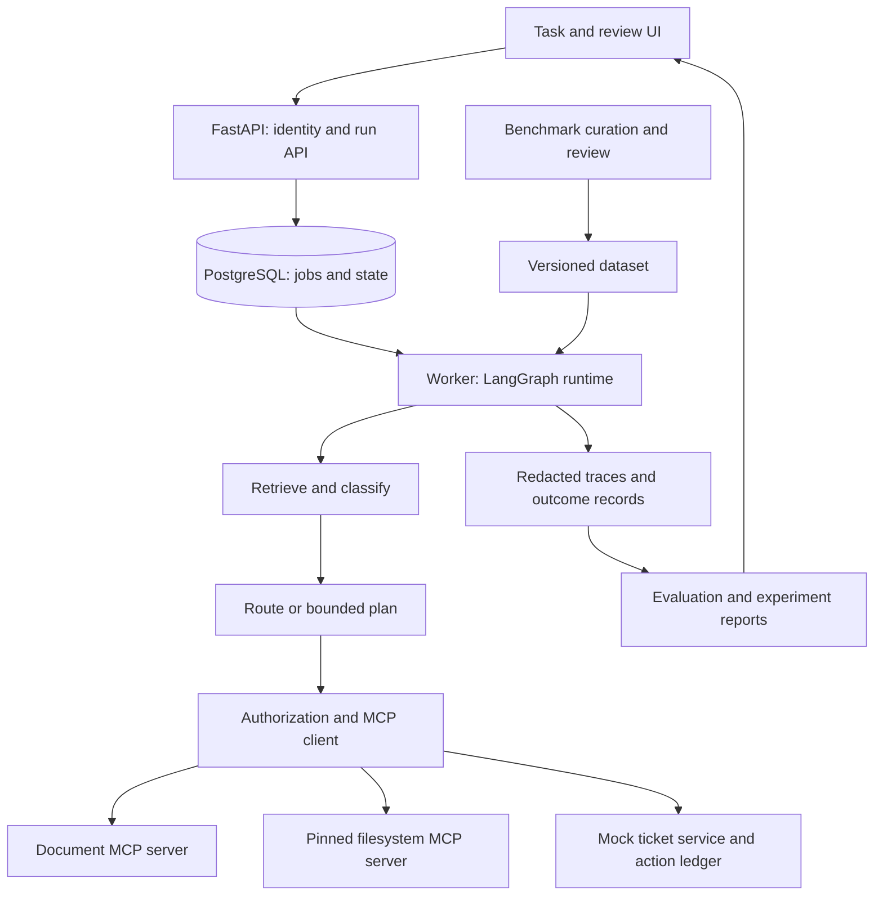
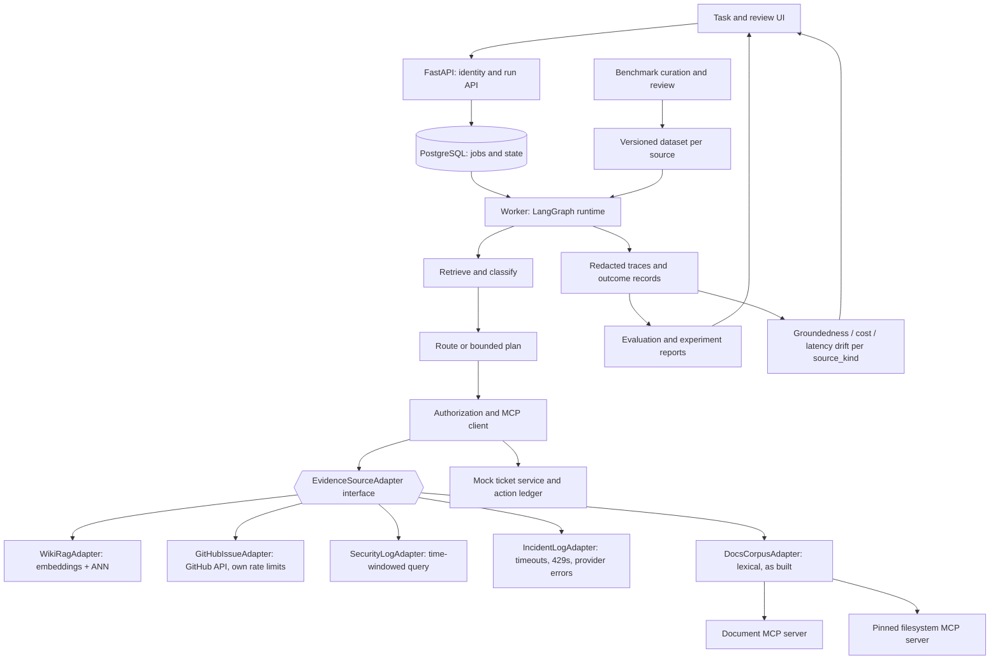

# AgentOps Workbench

English design proposal · September 8, 2026 · Main target: AI Agent / Applied AI Engineer

## What You Are Building

A support-operations agent that turns a software issue into a grounded answer and a ticket draft, plus an experiment workbench that measures prompt, workflow and tool-integration choices. Users submit an issue, inspect evidence and approve an exact ticket action. Engineers compare configurations on the same domain benchmark.

The contribution is a complete application and a defensible optimization study. It is not a new general-purpose agent framework. Use LangGraph from the first release, LangChain integrations, and real MCP protocol calls to local controlled services.

## Why This Portfolio Supports Interviews

The supplied job asks for five connected abilities. This project gives one visible artifact for each: prompt experiment, topology comparison, node/task scorecard, benchmark curation and tested MCP integration. Python server behavior and delivery are demonstrated in the same application.

AgentOps asks which workflow should be shipped and why. Share run IDs, trace export and reviewed cases. Implement one repository; avoid building duplicate trace explorers or workers.

## Pivot (2026-09-13): Open-Source Maintainer Tooling, Adapter-Generalized Evidence Sources

> **Amendment, not a rewrite.** Everything below this section — §"What You
> Are Building", §"User Story and Scope", the six task families, the Phase
> 0–6 build guide — is the **historical record of what was actually built
> and merged** (see [`phases/index.md`](../../phases/index.md) and
> [`phases/build-report.md`](../../phases/build-report.md)). It is left
> intact on purpose. This section states what supersedes it going forward
> and why, in the same place a reader will look for the project's current
> framing.

### What changes

The original framing — *"a support-operations agent that turns a software
issue into a grounded answer and a ticket draft"* — is **retired from the
portfolio narrative**. The reason is not technical: the operator has no
domain expertise in customer support and therefore cannot credibly judge
whether an answer is good, which makes every quality claim built on that
framing indefensible in an interview. A benchmark whose owner cannot grade
its own gold labels is not evidence.

It is superseded by a **developer-tooling / open-source-maintainer**
framing. The same three inputs the system already handles (an issue, a
searched corpus, a run's own trace) are a far better fit there:
*GitHub Issue analysis + wiki RAG + prompt-log analysis* is not support
operations. It is automation and observability for open-source and DevOps
tooling — a domain the operator does work in and can defend.

### What does not change

The architecture carries forward largely unchanged: LangGraph topologies
(`fixed` / `single_agent` / `planner_executor`), real MCP tool execution,
the FastAPI run/approval surface, the `LLMAdapter` provider abstraction,
OpenTelemetry tracing, and the benchmark harness with its frozen splits.
Phases 0–6 are not re-planned and their audit findings stand.

**One seam generalizes: the evidence source.** Today the graph reaches
evidence through a single `DocumentClient` Protocol backed by a fixed
`fixtures/docs/*.md` corpus. That Protocol becomes a named
`EvidenceSourceAdapter` pattern with per-deployment implementations —
`WikiRagAdapter`, `GitHubIssueAdapter`, `SecurityLogAdapter`,
`IncidentLogAdapter` — selected by configuration, exactly the way
topologies and LLM providers already are. Mechanics, the deliberate method
rename, the per-adapter cost and the staged migration are in
[**ADR-0007: Evidence-source adapter pattern**](../../apps/agentops-workbench/docs/adr/0007-evidence-source-adapter-pattern.md).
Execution is tracked as [Phase 7](../../phases/07-adapter-pattern-pivot/index.md).

The pattern is not invented here. `DocumentClient` is already an
adapter-shaped seam that `graph/planner_executor.py` consumes by Protocol
(PR #21, merged), and PR #29 (open) adds `SubprocessDocumentClient` as a
second real implementation of it. The pivot names the pattern and adds
siblings for non-document sources; it does not start from nothing.

### Pillar 1 — Open Source Maintainer Helper Agent

An external contributor files a GitHub Issue on a repository. The agent
retrieves the project's own wiki / technical documentation, produces a
grounded answer or triage draft with citations, and refuses when the
evidence does not support an answer. Value: a maintainer answering the
same question for the twentieth time gets a cited draft instead of a blank
box.

Mapped onto what exists, rather than restated as ambition:

| Old framing's role | Post-pivot role | Backed by |
|---|---|---|
| `get_issue` (a prompt string only — never a real tool; see `build-report.md`) | `GitHubIssueAdapter.read_evidence()` — the task input itself | new, ADR-0007 §3 |
| `search_docs` / `read_document` over `fixtures/docs/` | `WikiRagAdapter.search_evidence()` / `read_evidence()` | generalizes the existing Protocol |
| `create_ticket_draft` / `publish_ticket` (never implemented as tools) | triage / answer draft through the existing approval path: `POST /v1/actions/{id}/approve` → `TicketLedger.publish()` (PR #30, open, wires the execute half) | existing surface |

Topology: `planner_executor`, the variant that already receives a
`DocumentClient` through graph state and records per-call `tool_results`
(PR #21, merged). "Issue in → wiki evidence out → cited draft" is a
plan-then-retrieve-then-synthesize shape, which is what that topology
does. Note the honest caveat: ADR-0006 selected the **fixed** graph as the
default, and that selection was made over the synthetic corpus with
stubbed tools. ADR-0007 scopes ADR-0006's decision to the docs corpus;
the topology choice must be re-measured per evidence source, and
`graph/fixed.py` — which reads `fixtures/docs/` directly — cannot consult
a GitHub issue at all without change.

### Pillar 2 — Prompt Observability & Eval

**The substrate is already shipped. Naming it accurately matters more than
claiming it as new work.** What exists today:

- `llm/adapter.py:Usage` — normalized `provider, model, prompt_tokens,
  completion_tokens, total_tokens, cost_usd` per model call, from every
  adapter.
- `db/models.py:ToolCall` — persisted `{tool_name, policy_decision,
  action_key, args_canonical, outcome, latency_ms}` rows with real
  args-based idempotency keys.
- `graph/planner_executor.py:_execute_node` — per-call
  `{tool_name, outcome, latency_ms, error_kind}` accumulated into
  `tool_results` (PR #21, merged; PR #25 open with review fixes; PR #26
  open, extends the same to `single_agent`).
- `classify_mcp_error` — failures bucketed into
  `timeout / disconnect / malformed / unsupported_capability /
  permission_denied`.
- OpenTelemetry span export, and the frozen-manifest experiment runner.

So tokens, cost, latency, tool outcome and trace already flow. The **new**
work is the quality and drift layer on top:

1. **Answer-groundedness scoring over time.** The current `task_success`
   scorer is exact-substring match against a human-written expected
   outcome — `build-report.md` records it as conservative, and the
   held-out run reports `0/24`. Groundedness ("is every claim in the
   answer traceable to a retrieved `EvidenceRef`?") is the metric that
   actually generalizes across evidence sources, because a substring oracle
   does not survive a log-aggregate citation.
2. **Cost / latency drift detection.** The per-run `Usage` and `ToolCall`
   rows are already a time series; nothing reads them as one. Detecting
   that p95 latency or cost-per-successful-task regressed after a prompt
   or provider change is a reducer over data that exists, not new
   instrumentation.
3. **Per-source metric segmentation.** Once adapters exist, every metric
   is reported per `source_kind`. Pooled numbers across a wiki and a log
   source would be meaningless.

*Related prior art, not the same initiative:* repo issue
[#22](https://github.com/sh-ai-x/AgentOpsPipeline/issues/22) proposes a
`claim_fidelity` measurement — `claim.made` / `claim.audit` events and a
`false_positive_rate = refuted / audited` reducer — for **dev-kit's own
harness effectiveness**, i.e. whether a *build agent's* completion claims
about the harness are true. It shares the independent-verification
mechanism with this pillar and nothing else: different event stream,
different subject (the harness, not this agent's answers), different
consumer. Cited here so the lineage is visible; its scope is not absorbed
into this proposal and neither one's numbers should be quoted for the
other.

### Pillar 3 — ROI in the open-source ecosystem

The claim: a maintainer spends a large, recurring share of issue-triage
time re-answering questions the project's own documentation already
answers. An agent that drafts a cited answer converts that from writing to
reviewing.

**Illustrative arithmetic — not a measured result.** Every number below is
a placeholder for the shape of the argument, and none of it belongs on a
résumé until measured:

> *Illustrative only.* 40 issues/month × 50% already-documented ×
> 10 min/answer ≈ 3.3 maintainer-hours/month. At the workbench's observed
> live cost of **$0.0124 for 24 runs** (`experiments/held-out-v1/`,
> `MiniMax-M3`), the model spend for 40 drafts is cents. The economics are
> not the question; answer quality is.

What would actually validate it — this project's own benchmark methodology
turned on itself, which is the only honest way to make an ROI claim in a
portfolio:

1. A reviewed benchmark of **real** issues from a real repository, with
   gold answers and gold evidence, curated under
   [ADR-0004](../../apps/agentops-workbench/docs/adr/0004-dataset-separation.md)'s
   frozen-split discipline, with reviewer and split recorded per case.
2. **Draft-acceptance rate**: what fraction of drafts a maintainer posts
   with no edit, minor edit, or discards. This is the ROI metric.
   Time-saved is downstream of it and must not be reported without it.
3. **Groundedness and refusal correctness** on the same set — a confidently
   wrong cited answer costs a maintainer *more* time than a blank box,
   which is the failure mode this claim has to survive.
4. Cost per accepted draft from the `Usage` rows, and the same
   uncertainty discipline §"Evaluation and Optimization Design" already
   imposes: small samples are illustrative, not statistically settled.

Until (1)–(4) exist, the ROI story is a stated hypothesis with a named
falsification test, and it is presented that way.

### Out of scope for the pivot

Generic customer support and general end-user ticketing, in any framing.
The operator cannot judge answer quality in that domain, so no claim built
on it is defensible. Excluded from the portfolio narrative permanently —
not deferred.

## User Story and Scope

An engineering support user submits a repository issue. The system retrieves versioned documentation, asks for clarification when necessary, proposes a supported answer and optionally creates a ticket draft. Publishing occurs only to a local mock ticket service after server-validated approval.

MVP tools: `search_docs`, `read_document`, `get_issue`, `create_ticket_draft`, `publish_ticket`. The document service is a custom MCP server. Integrate **one pinned existing MCP server**: `@modelcontextprotocol/server-filesystem` against a synthetic read-only fixture directory. Do not grant unrestricted local filesystem access.

> **Superseded as of the 2026-09-13 pivot** — see §"Pivot (2026-09-13)" and
> [ADR-0007](../../apps/agentops-workbench/docs/adr/0007-evidence-source-adapter-pattern.md).
> This tool list is kept as the historical MVP scope. Two of the five were
> ever real tools (`search_docs`, `read_document`); `get_issue` is a prompt
> string and the two ticket tools were never implemented as tools — see
> [`phases/build-report.md`](../../phases/build-report.md). Going forward the
> retrieval tools become **adapter-specific per deployment target**
> (`search_evidence` / `read_evidence` on an `EvidenceSourceAdapter`), and
> the ticket tools are replaced by the existing approval →
> `TicketLedger.publish()` path rather than by new tools.

Task families: straightforward answer, multi-document answer, ambiguous request, missing evidence, conflicting/stale documentation and tool failure. Multi-agent behavior is an experimental variant, not a requirement for every task.

## Tech Stack

| Component | Choice | Reason / boundary |
|---|---|---|
| Language | Python, uv, Pydantic, pytest, Ruff | Typed contracts and reproducible setup; pin tested versions |
| Orchestration | LangGraph | Explicit state, conditional routing, checkpoints, interrupts/resume |
| Model integration | LangChain chat-model wrapper per provider; single `LLMAdapter` interface | Provider-agnostic graph; default live `provider=minimax`, CI `provider=local-fake`; others (openai, anthropic) per-experiment |
| MCP | Official Python SDK; custom document server + `@modelcontextprotocol/server-filesystem` (version-pinned, fixture-only scope) | Demonstrates integration and development; adopt a documented protocol revision |
| Evidence sources *(added 2026-09-13)* | One `EvidenceSourceAdapter` Protocol; `DocsCorpusAdapter` today, plus `WikiRagAdapter` / `GitHubIssueAdapter` / `SecurityLogAdapter` / `IncidentLogAdapter`, selected by `AGENTOPS_EVIDENCE_SOURCES` | Per-deployment evidence without touching the graph; same registry idiom as topologies and providers. MVP tool names become adapter-specific — see [ADR-0007](../../apps/agentops-workbench/docs/adr/0007-evidence-source-adapter-pattern.md) |
| API | FastAPI, Bearer/JWT auth | Run, approval; CLI for experiments and dataset review in MVP |
| Persistence | PostgreSQL, SQLAlchemy, Alembic | Jobs, checkpoints, action ledger, dataset and experiment metadata |
| Retrieval | Lexical baseline | Compare retrieval before adding infrastructure (pgvector deferred) |
| Evaluation | pytest, JSONL fixtures, Python analysis | Transparent outcome checks and experiment manifests |
| Tracing | OpenTelemetry only | Correlate model calls, tools, state transitions and failures |
| UI | Streamlit | Submit tasks, approve actions and compare runs without a large frontend project |
| Delivery | Docker Compose, GitHub Actions | Offline CI and a reproducible demo |

**Out of scope for MVP**: fine-tuning, Kubernetes, autonomous deployment, ML router baseline (TF-IDF/logistic regression), LangSmith export, A2A, second SDK, vector search, benchmark candidate generator pipeline, UI polish.

## Architecture

**As built (Phases 0–6)** — the historical diagram, kept unchanged:



**Post-pivot (2026-09-13)** — identical except where the single document
MCP server box sat, one `EvidenceSourceAdapter` interface now fronts N
parallel adapters. Nothing upstream of `G` changes; see
[ADR-0007](../../apps/agentops-workbench/docs/adr/0007-evidence-source-adapter-pattern.md):



Read the two diagrams together: `A0` is everything the first diagram had;
`A1`–`A4` are siblings behind the same interface, and `O` is Pillar 2's new
layer over the already-shipped `Usage` / `ToolCall` records.

## Auth and Identity

FastAPI Bearer token (HS256 JWT, dev secret in `.env`). `principal_id` claim drives identity.

Authentication supplies the principal; the model cannot choose one. Authorize documents and tools using that identity. Model-generated arguments are untrusted. Check current permissions and approval immediately before effects, not just during planning.

## Provider and Model Abstraction

Config-driven: `provider ∈ {openai, anthropic, minimax, local-fake}`, `model=<id>`. A single `LLMAdapter` interface returns normalized usage (`provider, model, prompt_tokens, completion_tokens, total_tokens, cost_usd`). LangChain chat-model wrapper per provider. **No provider-specific code paths in the agent graph.**

Defaults:

- **CI / unit tests**: `provider=local-fake` — deterministic scripted responses, no API calls, no network.
- **Live experiments**: `provider=minimax` (default) — see Tech Stack row "Model integration" for the chosen adapter.
- **Other providers** (`openai`, `anthropic`) available per-experiment via environment or manifest.

**No GPU inference in this project.** All model calls go over HTTPS to a hosted LLM API. The agent runs on a CPU-only container; provider billing and rate limits are the only cost axes.

This shape lets you ship with MiniMax today and swap to OpenAI or Anthropic later without touching the workflow code.

## Contracts and APIs

```text
Run: id, principal_id, state, graph_version, prompt_version,
     model_config, budget, code_sha, trace_id
ToolCall: id, run_id, tool_name, policy_decision, action_key, outcome, latency
BenchmarkCase: id, family_id, source_refs, task, expected_outcome,
               allowed_tools, reviewer, split
Experiment: id, dataset_version, config_hash, code_sha, trial_ids,
            token_usage, cost_estimate, started_at

POST /v1/runs                   GET /v1/runs/{id}
POST /v1/runs/{id}/cancel       POST /v1/actions/{id}/approve
```

CLI for experiments and benchmark review.

Use object authorization on every run/action lookup. Approval binds user, run, tool, canonical arguments, expiry and one-use nonce. Cancellation stops future work and reports already-completed actions; it does not imply rollback of external effects.

Use queued → running → waiting_for_approval → succeeded/failed/cancelled states. Persist checkpoints and durable job leases. On worker restart, recover expired claims. Tool calls use stable action keys; after a crash following dispatch, query the mock ledger before retrying. Checkpointing alone cannot guarantee exactly-once external effects.

MCP integration tests cover discovery, schema validation, timeout, malformed results, unsupported capabilities and server disconnect. Keep credentials out of prompts and trace payloads. Separate local stdio setup from authenticated remote transport; follow the selected transport's protocol requirements rather than assuming they are interchangeable.

## Evaluation and Optimization Design

Start with 12 manually reviewed pilot tasks. Target **30 total cases** across six families, split **18 development / 6 validation / 6 held-out**, grouped by source-document and scenario template. Keep near-duplicates together. Tune only on development/validation; freeze the held-out set before final selection.

Cases are reviewed manually by a human reviewer who records provenance and split. A synthetic candidate generator pipeline is deferred to a later phase.

Compare three execution variants: fixed graph, single tool-using agent and bounded planner/executor. First compare three prompts under a fixed graph; choose using validation. Then compare topologies using that prompt family, model, corpus, tool permissions and budgets. Label this staged selection and its interaction limitation; a full factorial search is optional.

Use deterministic outcome checks first; an optional isolated LLM judge scores groundedness on a human-reviewed subset and cannot grant permission or promote labels.

| Metric | Definition | Proposed release criterion |
|---|---|---|
| Task success | Cases satisfying the allowed end-state oracle / all attempted cases | Report raw counts by family; select an improvement only when evidence supports it |
| Retrieval recall@k | Relevant source IDs retrieved / gold relevant source IDs | Report independently of generation scores |
| Tool correctness | Calls with correct allowed tool and arguments / scored calls | Include valid-schema but incorrect-meaning failures |
| Reliability | Recovery, timeout/cancel and duplicate-effect behavior | All defined deterministic critical tests pass |
| Cost/latency | Tokens and estimated cost per attempted and successful task; p50/p95 latency | Compare under common caps; retain timeouts in success denominators |
| Benchmark quality | Reviewed acceptance/correction/duplicate rate and family coverage | Every promoted case has reviewer and split |
| Security | Cross-scope access and unauthorized mock actions completed | Zero escapes in the specified deterministic suite; no universal guarantee |

All numbers are design targets, not achieved results. Record repeated live trials and paired case-level differences; use case-family-aware uncertainty where sample size permits. The held-out set is small (6 cases) by design — interpret results as illustrative, not statistically settled. Extra trials of one case do not create independent scenarios. Temperature zero does not guarantee reproducibility.

Suggested final experiment: **6 held-out cases × 2 selected topologies × 2 trials = 24 runs**, after a small cost pilot. Configure a spend ceiling before execution using actual provider rates. Shrink the sample and state the limitation if budget is insufficient. Deterministic fake-response CI checks control flow, not live-model quality.

## Step-by-Step Build Guide

### Phase 0: Scope and Ground Truth — Week 1, first half

1. Define one user workflow, useful outcomes, permissions and excluded features.
2. Create 12 pilot tasks and source documents with explicit expected outcomes.
3. Design typed run/tool/case contracts and baseline experiment manifest.
4. Write ADRs for LangGraph, MCP boundaries, provider abstraction, dataset separation.

Deliverables: scope, fixture schema, pilot dataset, architecture. Exit: another developer can score the pilot without guessing what "good" means.

### Phase 1: Runnable Agent and API — Weeks 1–2

1. Implement fixed LangGraph retrieval → classification → answer/draft workflow using a LangChain chat-model wrapper; provider-agnostic.
2. Add FastAPI run creation/status, durable state, Bearer/JWT auth, and live + fake model adapters behind `LLMAdapter`.
3. Add bounded steps, deadlines, cancellation and explicit insufficient-evidence responses.
4. Build the mock ticket ledger and basic UI; test normal and failed requests.

Deliverables: clean-checkout demo and typed API. Exit: normal task completes, missing evidence produces a supported refusal/clarification, failed tool is visible. Start applications with this slice.

### Phase 2: MCP and Reliable Tool Use — Week 3

1. Implement the document MCP server and integrate `@modelcontextprotocol/server-filesystem` (pinned version, fixture-only scope).
2. Add call validation, timeouts, capability handling and error normalization.
3. Enforce identity/scope and action-bound approval before publishing.
4. Exercise restart, duplicate delivery, malformed results and unauthorized direct calls.

Deliverables: server/client contract suite and recovery report. Exit: tools work through the protocol and a repeated action does not duplicate the mock effect.

### Phase 3: Benchmark Curation and Prompt Experiments — Week 4

1. Manually curate 30 cases across the six families; review expected outcomes.
2. Freeze dataset splits; record per-case provenance and reviewer.
3. Implement node/task scorers.
4. Compare three prompt versions on validation; publish one unsuccessful change.

Deliverables: dataset card, review record and prompt report. Exit: every promoted case is traceable and held-out data has not influenced tuning.

### Phase 4: Topology and Planning Experiments — Week 5

1. Add single-agent and bounded planner/executor variants using the same tool contracts.
2. Apply identical budgets, corpus and permissions; implement stop/escalation conditions.
3. Compare success, call count, cost and latency; inspect cases where planning harms performance.
4. Choose a shipping configuration on validation and record its limitations.

Deliverables: topology comparison and ADR. Exit: selection follows measured utility; a simpler workflow may win.

### Phase 5: Failure Evidence and Delivery — Weeks 6–7

1. Export redacted OpenTelemetry traces.
2. Turn one reviewed failure into an executable regression.
3. Finish recovery, scope isolation and approval replay tests.
4. Package containers, migrations, offline CI and an operator runbook.

Deliverables: reproducible release and failure-to-test walkthrough. Exit: a clean setup works, seeded regression fails CI and traces do not expose synthetic secrets.

### Phase 6: Held-Out Evaluation and Portfolio — Week 8

1. Freeze chosen configurations and run the budgeted held-out experiment.
2. Publish raw outcomes, manifests, failed cases and uncertainty.
3. Record a five-minute demo: task → MCP calls → result → comparison → regression.
4. Write a concise evidence card with personal contributions and measured results only.

Deliverables: release, report, recording and résumé evidence. Exit: a reviewer can reproduce an offline failure and inspect the basis for the shipping decision.

### Phase 7: Adapter Generalization and OSS-Maintainer Pillars — added 2026-09-13

Added by §"Pivot (2026-09-13)". Phases 0–6 above are closed history; this
is the first phase planned under the new framing.

1. Rename the `DocumentClient` Protocol to `EvidenceSourceAdapter`
   (`search_evidence` / `read_evidence` / `EvidenceRef`); move
   `list_filesystem_files` to a `FilesystemScopedSource` extension. Pure
   refactor, unchanged test count. Lands after PRs #25–#31.
2. Add an `EVIDENCE_SOURCES` registry + `AGENTOPS_EVIDENCE_SOURCES`
   config with startup validation, mirroring `TOPOLOGIES` and the provider
   allow-list. `DocsCorpusAdapter` registered; behaviour identical.
3. Ship `IncidentLogAdapter` over the existing `ToolCall` / `Usage` rows —
   the first non-document source, no new credential.
4. Ship `GitHubIssueAdapter` with recorded-fixture CI, a marked live
   integration test, rate-limit handling, and a per-repo scope negative
   test.
5. Add groundedness scoring and per-`source_kind` cost/latency drift
   reporting over the already-persisted `Usage` / `ToolCall` series.

Deliverables: ADR-0007 mechanics realized; two registered non-docs
adapters; per-source metric segmentation. Exit: a run against a GitHub
issue produces a cited draft whose every citation resolves to an
`EvidenceRef` from a registered adapter, with the docs-corpus test suite
passing unchanged and `retrieval_recall` reported per `source_kind`.
`WikiRagAdapter` and `SecurityLogAdapter` are explicitly **not** in this
phase — the first carries a pgvector reversal needing its own ADR.

## Schedule Cuts and Presentation

Cut UI polish, vector search, ML router baseline, benchmark candidate generator first. If time is short, keep a fixed graph and one agent variant with 30 reviewed cases, label the smaller experiment and finish the complete loop. Do not claim improvements before measuring them.

Résumé template after implementation: "Built a LangGraph/FastAPI support agent integrating [N] MCP servers; compared [K] workflow configurations on [M] held-out scenarios and shipped [configuration] based on task success, recovery, latency and cost." Fill placeholders only from published results.

> **Replaced 2026-09-13** (§"Pivot"). The template above names a "support
> agent" and is retired with that framing. Current template: "Built a
> LangGraph/FastAPI open-source-maintainer agent that answers repository
> issues from project documentation, with a pluggable evidence-source
> adapter layer over [N] sources; compared [K] workflow configurations on
> [M] held-out scenarios and shipped [configuration] based on groundedness,
> draft-acceptance rate, latency and cost." Same rule, restated because it
> matters more now that the pillars make larger claims: **fill placeholders
> only from published results.** `draft-acceptance rate` in particular does
> not exist yet — Pillar 3 names it as the metric that would validate the
> ROI claim, not as one already measured.

## References

- [LangGraph](https://docs.langchain.com/oss/python/langgraph/overview) — runtime reference.
- [MCP architecture](https://modelcontextprotocol.io/docs/learn/architecture) — integration contract reference.
- [Study competency map](../topic/06-agent-engineer-competency-map.md) — preparation context.