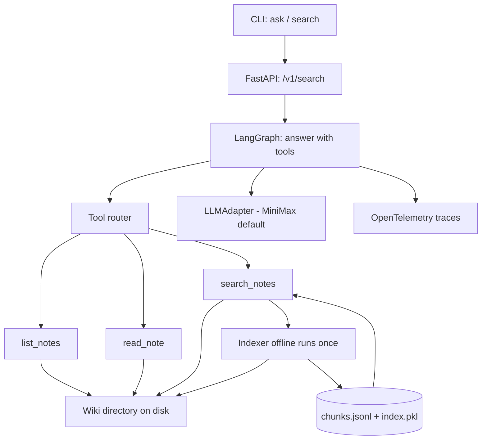

# LLM Wiki Search

English design proposal · September 8, 2026 · Main target: AI Agent / Applied AI Engineer

## What You Are Building

A lightweight command-line tool that turns **any local wiki-style directory** into a queryable knowledge base. Point it at `~/dev/mywiki` (or any folder of markdown notes), and ask questions in natural language — get grounded, cited answers drawn from those notes.

```
$ llm-wiki ask --dir ~/dev/mywiki "How do I rotate the AcmeCloud API key?"
# → Reads docs in ~/dev/mywiki, cites sources, refuses when evidence is missing.
```

The tool is **directory-agnostic**: the input path is a parameter. It indexes whatever you point it at, then answers questions grounded only in that corpus. No hallucinated answers — when the notes don't cover a topic, the tool says so explicitly.

## Why This Portfolio Supports Interviews

This project demonstrates five connected AI-engineering competencies in one small, defensible artifact:

1. **Prompt experimentation** — system prompt variants compared on real queries.
2. **Topology comparison** — single-prompt vs. tool-using variants on the same corpus.
3. **Node/task scorers** — deterministic checks for citation presence, refusal triggers, latency bands.
4. **MCP integration** — real protocol use with one custom server (the wiki index).
5. **Provider abstraction** — MiniMax default, swappable, with normalized cost/usage tracking.

The scope is small (single-machine CLI, no DB) so the methodology is the artifact, not the implementation.

## User Story and Scope

A developer (you, or a teammate) has a folder of personal or team notes — Obsidian vault, Notion export, plain markdown, org-mode files. They want to ask questions across that corpus without re-reading everything or copy-pasting into a chat box.

**MVP tools** (three total):

- `list_notes` — list files in the indexed directory with metadata.
- `read_note` — read a specific note by path or note-id.
- `search_notes` — BM25 lexical search across the indexed chunks; returns top-k matching chunks with their source paths.

**Refusal contract** — when no chunk matches a query's intent, the tool says "no relevant notes found" with a list of the closest partial matches. It never invents content from outside the corpus.

**Family of queries** the eval must cover:

| Family | Example | Expected answer class |
|---|---|---|
| Single-note fact | "What's the policy on TLS 1.0?" | grounded, 1 source |
| Multi-note synthesis | "How do auth and billing interact?" | grounded, ≥2 sources |
| Missing evidence | "When is the Q3 product launch?" | refusal — no relevant notes |
| Ambiguous query | "Tell me about security" | clarification request |
| Cross-reference | "What does note X say about Y?" | grounded, 1 specific source |

## Input: Wiki Directory

The tool takes **a directory path** as input (config or CLI flag). At index time, it walks that directory and ingests all readable text files.

```yaml
# config.yaml
wiki:
  root: ~/dev/mywiki
  include_globs:
    - "**/*.md"
    - "**/*.markdown"
    - "**/*.txt"
    - "**/*.org"
  exclude_globs:
    - "**/.obsidian/**"
    - "**/attachments/**"
    - "**/*.tmp"
  max_file_size_kb: 256
  max_total_corpus_mb: 100
```

**Default corpora** (for development):

- `~/dev/mywiki` — your personal notes (Obsidian vault).
- `~/dev/dev-harness-kit/logs/claude-code/` — session transcripts, indexed as notes.
- A small bundled sample corpus for tests (`fixtures/sample-wiki/`, ~10 files, ~50 KB).

The same tool runs against any of them; no code changes required.

## Memory Budget

Target: **working set ≤ 800 MB** on a 2 GB-RAM machine.

| Component | Estimated RAM | Notes |
|---|---|---|
| Python 3.11 + minimal deps | 80 MB | uv env |
| FastAPI/uvicorn (1 worker) | 60 MB | single process, async |
| LangGraph runtime | 120 MB | one in-flight query at a time |
| LangChain wrapper (no model) | 40 MB | provider is API-only |
| BM25 index loaded read-only | 50 MB | ~30 MB corpus + 10 MB index + 10 MB padding |
| Working state (current query) | 50 MB | streamed responses; LLM responses not retained |
| **Total working set** | **~400 MB** | Headroom: ~1.6 GB |

**What we cut to fit**:

- No embedding model — lexical BM25 only (saves 200–500 MB).
- No PostgreSQL — JSONL + SQLite for metadata (saves ~300 MB).
- No Streamlit — CLI only (saves 200 MB).
- No background workers — single uvicorn process.
- No vector store — no pgvector.

## Tech Stack

| Component | Choice | Reason / boundary |
|---|---|---|
| Language | Python 3.11, uv, Pydantic, pytest, Ruff | Typed contracts; reproducible setup |
| Orchestration | LangGraph (one node: "answer with tools") | Minimal; one in-flight run |
| Model integration | LangChain chat-model wrapper per provider; `LLMAdapter` interface | Default live `provider=minimax`, CI `provider=local-fake`; others (openai, anthropic) per-experiment |
| Index | BM25 (`rank_bm25`), pure Python | No embeddings; ~5 MB index for 30 MB corpus |
| Storage | JSONL chunks + SQLite metadata | No external DB; total disk < 200 MB |
| API | FastAPI (single uvicorn worker) | One `/v1/search` endpoint; CLI also calls it |
| Tracing | OpenTelemetry only | Correlate model calls, tools, state transitions |
| Delivery | Docker Compose (offline CI), GitHub Actions | Reproducible demo |
| UI | CLI (click or textual) | No Streamlit; memory budget |

**No GPU inference in this project.** All model calls go over HTTPS to a hosted LLM API. The agent runs on a CPU-only container; provider billing and rate limits are the only cost axes.

**Out of scope for MVP**: fine-tuning, Kubernetes, autonomous deployment, ML router baseline, LangSmith, vector search, embeddings, multi-tenant isolation, web UI, ticket-system integration, approval flows.

## Architecture



## Provider and Model Abstraction

Config-driven: `provider ∈ {openai, anthropic, minimax, local-fake}`, `model=<id>`. Single `LLMAdapter` interface returns normalized usage (`provider, model, prompt_tokens, completion_tokens, total_tokens, cost_usd`). LangChain chat-model wrapper per provider. **No provider-specific code paths in the agent graph.**

Defaults:

- **CI / unit tests**: `provider=local-fake` — deterministic scripted responses, no API calls.
- **Live runs**: `provider=minimax` (default) — see Tech Stack row for the chosen adapter.
- **Other providers** (`openai`, `anthropic`) available per-experiment via environment or config.

This shape lets you ship with MiniMax today and swap providers later without touching the workflow code.

## Contracts and APIs

```text
QueryRequest: query, wiki_root, top_k, model_config, max_cost_usd
QueryResponse: answer, answer_class, cited_paths, tool_calls, usage, latency_ms, trace_id
ChunkRef: chunk_id, source_path, line_range, score
NoteMeta: path, title, mtime, size_bytes
ToolCall: id, query_id, tool_name, args, outcome, latency_ms

POST /v1/search            # CLI calls this
GET  /v1/health
POST /v1/index/rebuild    # offline indexer trigger
```

CLI:

```
llm-wiki ask --dir ~/dev/mywiki "your question here"
llm-wiki index --dir ~/dev/mywiki [--rebuild]
llm-wiki eval --manifest fixtures/eval.jsonl
```

Use object authorization on every API call (single-user MVP: skip; document as future authz). Cost ceiling enforced per-request via `max_cost_usd`; tool-call results truncated to budget.

## Evaluation and Optimization Design

Start with 12 manually reviewed pilot queries against `fixtures/sample-wiki/`. Target **30 total queries** across five families, split **18 development / 6 validation / 6 held-out**.

Compare three execution variants: fixed single-prompt, single tool-using agent, multi-step planner. First compare three prompt versions under a fixed graph; choose via validation. Then compare topologies using that prompt family, model, corpus, tool permissions, and budgets. Staged selection with its interaction limitation labeled; full factorial optional.

| Metric | Definition | Proposed release criterion |
|---|---|---|
| Task success | Queries satisfying the allowed end-state oracle / all attempted | Report raw counts by family |
| Citation accuracy | Cited paths that exist + match the answer's content | ≥ 0.95 |
| Refusal correctness | Refusals on missing-evidence queries | 100% on the held-out missing-evidence cases |
| Retrieval recall@k | Relevant note paths retrieved / gold paths | Report independently |
| Cost / latency | Tokens + cost per query; p50/p95 latency | Compare under common caps |

Suggested final experiment: **6 held-out × 2 topologies × 2 trials = 24 runs**, after a small cost pilot. Configure a spend ceiling using actual provider rates. Deterministic fake-response CI checks control flow, not live-model quality.

## Step-by-Step Build Guide

### Phase 0: Scope and Indexer — Day 1

1. Define query families; pick default corpus (`~/dev/mywiki`).
2. Write the offline indexer: walk `wiki.root`, chunk markdown into ~500-token blocks with frontmatter and headings preserved.
3. Build BM25 index; write `chunks.jsonl` and `index.pkl`.
4. Verify index loads in < 1s and uses < 100 MB RAM.

Deliverables: indexer script + sample index. Exit: indexed `~/dev/mywiki` answers "what's in here?" with one chunk.

### Phase 1: Runnable Agent and CLI — Day 2

1. Implement LangGraph node: `answer_with_tools(query, history=[])`.
2. Wire `LLMAdapter` with `provider=local-fake` for CI; MiniMax for live.
3. Implement three tools (`list_notes`, `read_note`, `search_notes`) using the BM25 index.
4. CLI: `llm-wiki ask --dir ~/dev/mywiki "..."` → streamed answer with citations.
5. FastAPI `POST /v1/search` (CLI uses HTTP).

Deliverables: working CLI demo against your real `~/dev/mywiki`. Exit: 5 sample questions produce 5 grounded answers.

### Phase 2: Refusal Contract and Eval Harness — Day 3

1. Implement refusal trigger: if no chunk exceeds the BM25 score threshold and the LLM confirms no answer, return `answer_class=no-evidence` with partial matches.
2. Write 12 pilot queries against `fixtures/sample-wiki/`; review oracles.
3. Implement deterministic scorers: citation accuracy, refusal correctness, retrieval recall@k.
4. CI: pytest with `provider=local-fake` scripted responses.

Deliverables: refusal contract + 12-case pilot. Exit: missing-evidence queries return refusal 100% of the time.

### Phase 3: 30-Case Eval + Held-Out Run — Days 4–5

1. Curate remaining 18 queries; freeze 6 held-out.
2. Run three prompt versions on dev+val; pick winner.
3. Run two topologies × held-out × 2 trials = 24 runs.
4. Record aggregate metrics + per-case results in `reports/held-out.json`.
5. ADR for shipping config (which prompt + topology + provider).

Deliverables: dataset card, eval report, ADR. Exit: a reviewer can run `llm-wiki eval --manifest fixtures/eval.jsonl` and reproduce your numbers.

## Schedule Cuts and Presentation

Cut held-out experiments, multi-step planner, or any provider besides MiniMax first. If time is short, ship Phase 1 + 2 only (CLI + refusal contract + 12-case pilot) and skip the formal eval — still a credible portfolio artifact. Do not claim improvements before measuring them.

Résumé template after implementation: *"Built a directory-agnostic LLM wiki search tool that answers natural-language questions over any local notes folder; evaluated 2 prompt+topology configurations on 6 held-out queries and shipped [configuration] based on citation accuracy, refusal correctness, and cost."* Fill placeholders only from published results.

## References

- [LangGraph](https://docs.langchain.com/oss/python/langgraph/overview) — runtime reference.
- [MCP architecture](https://modelcontextprotocol.io/docs/learn/architecture) — integration contract reference.
- [rank_bm25](https://github.com/dorianbrown/rank_bm25) — pure-Python BM25.
- [Study competency map](../topic/06-agent-engineer-competency-map.md) — preparation context.